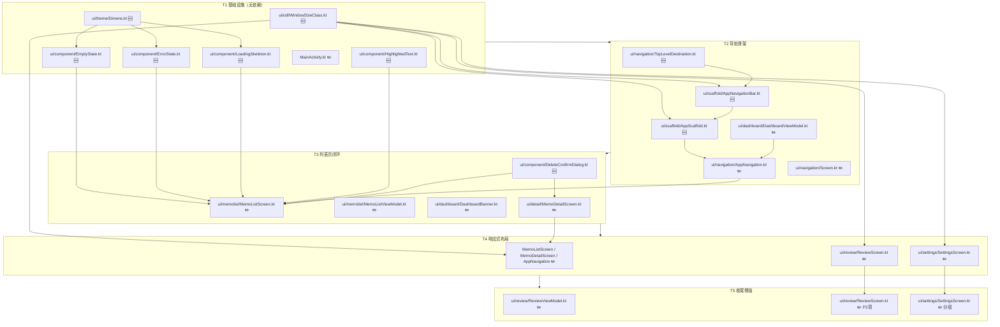
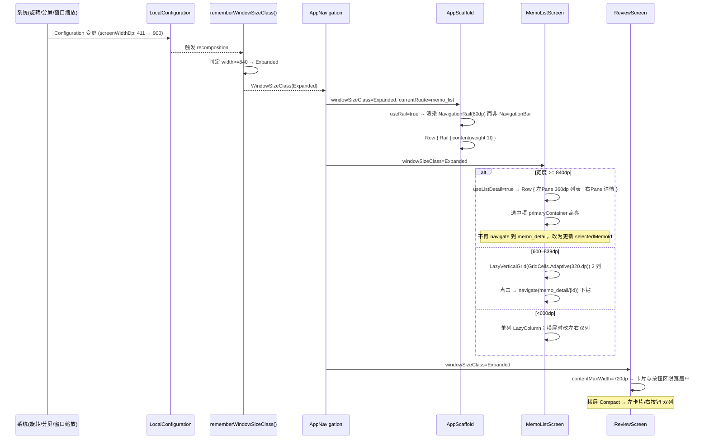
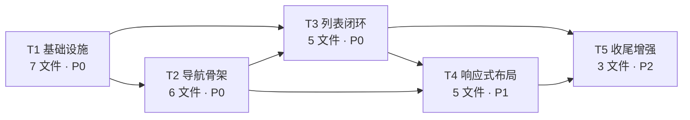

# 艾宾浩斯知识点备忘录 · 增量架构设计与任务分解

> 版本 v1.0 · 架构师：高见远（Gao）
> 输入：`design/UI_DESIGN_SPEC.md`（已批准）、`app/` 现有源码
> 范围：**仅 ui/ 层增量改造**，`core/` 与 `data/` 层原则上零改动
> 硬约束：`./gradlew test` 保持 100% 通过；`./gradlew assembleDebug` 必须成功

---

## 0. 现状勘察结论（读码所得，设计以此为准）

### 0.1 依赖实况（`app/build.gradle.kts`）

| 项 | 实际值 | 说明 |
|---|---|---|
| Compose BOM | `2024.10.01` | 解析出 **material3 1.3.1**、foundation 1.7.5 |
| material3 | **1.3.1** | `NavigationBar`/`NavigationRail`/`Badge`/`BadgedBox`/`Scaffold`/`SnackbarHost` **全部可用**（已解压 AAR 验证） |
| `androidx.compose.material3.windowsizeclass` | **不存在** | 已验证：material3-1.3.1 AAR 内 `windowsizeclass` 类数量 = **0** |
| `androidx.window:*` / `material3-adaptive` / `accompanist` | **本地 Gradle 缓存中完全不存在** | 引入需联网下载 |
| activity | 1.9.3 | `androidx.activity.EdgeToEdge` **已存在**，`enableEdgeToEdge()` 可用 |
| compileSdk / targetSdk | **35 / 35** | ⚠️ 与规范 §0 声称的「targetSdk 36」不一致，见 §8 风险 R1 |

### 0.2 关键代码事实

1. **ViewModel 作用域**：`AppNavigation.kt` 中 `MemoListViewModel` / `ReviewViewModel` / `DashboardViewModel` / `SettingsViewModel` 均在 **NavHost 之外** 创建 → 绑定 `LocalViewModelStoreOwner` = **MainActivity（Activity 级共享）**。
   仅 `MemoDetailViewModel` 在 `composable { }` 内以 `viewModel(key = "memo_detail_$memoId")` 创建 → **目的地级（pop 即销毁）**。
2. **测试脆弱点（必须规避）**：
   - `MemoListViewModelTest:107` 断言 `OnDeleteMemo(id)` **立即删除**。
   - `MemoListViewModelTest:131/136/141` 断言 `OnSearchQueryChanged` **同步生效**；`MainDispatcherRule` 使用 `UnconfinedTestDispatcher()`（**无虚拟时钟**）→ 在 ViewModel 里加 `debounce(300)` 会让这三条断言立即失败。
3. **Hero Banner 三态 A/B/C**：`DashboardBanner.kt` **已实现**（`limit<=0` → C，`dueToday==0` → B，否则 A），仅缺 C 态「去设置」链接、`deferredCount` 显式入参。此项工作量远小于预估。
4. **删除确认弹窗**：`MemoDetailScreen.kt` 已有 AlertDialog（error 色确认按钮），列表页缺失 → 抽为公共组件复用即可。
5. **DB 现状**：`AppDatabase version = 1`，`UserSettingsEntity` 仅有 `dailyReviewLimit / lastActiveDate / lastPromptedDate`，**无主题字段**。

---

## 1. 技术选型确认

### 1.1 决策一：WindowSizeClass —— **手写，零新增依赖** ✅

**结论**：不使用 `androidx.compose.material3.windowsizeclass`，**手写 `ui/util/WindowSizeClass.kt`**，基于 `LocalConfiguration.current.screenWidthDp / screenHeightDp`。

**理由**：
1. 已实证 material3 1.3.1 **不包含** `windowsizeclass`（这是独立 artifact `material3-window-size-class`，非 material3 自带）。
2. `material3-window-size-class` / `androidx.window:window-core` 均**不在本地 Gradle 缓存**，本次构建需联网解析；项目原则是「轻量级、零重型三方依赖」，且离线环境有失败风险。
3. 官方断点阈值是公开常量，手写结果与官方完全一致：**宽度 <600dp Compact / 600–839dp Medium / ≥840dp Expanded**。
4. `LocalConfiguration` 在旋转、分屏、Android 16 桌面窗口化缩放时均会触发 recomposition，满足规范 §8.3「实时重算布局」要求。

**已知取舍**：`LocalConfiguration` 返回的是 Activity 窗口 dp 宽度，未扣除系统栏；比 `WindowMetrics` 略粗。对本项目的三档断点判定无实质影响，接受。

### 1.2 决策二：Expanded 双窗格 —— **手写 Row 分栏，不引入 material3-adaptive** ✅

规范 §9 写的是「`ListDetailPaneScaffold` / material3-adaptive」，但该库**不在依赖中且不在缓存**。改为：
`Row { 左 Pane 360dp LazyColumn（选中高亮） + 垂直分隔线 + 右 Pane 详情 }`，纯 `foundation-layout` 实现，零依赖。

### 1.3 决策三：撤销功能 —— **不做软删除，Snackbar 仅告知** ✅

**结论**：保持 Room 物理删除 + CASCADE，**Snackbar 不提供「撤销」按钮**，仅文案告知。

**理由**：
1. 软删除需改 `KnowledgeMemoEntity`（+`deletedAt`）、全部 DAO 查询加 `WHERE deletedAt IS NULL`（含 `MemoWithReviewTask` 关联查询）、`ReviewTaskEntity` 级联语义、Repository 契约，并新增 **Room `version 1 → 2` Migration** + 「宽限期清理」调度。这是完整的 data 层改造，超出本次 ui/ 改造范围。
2. 现有 `DataLayerContractAdversarialTest` 对 DAO/Repository 删除契约有断言，改 data 层有回归风险，与「test 100% 通过」硬约束冲突。
3. 规范 §6 F4 已明确给出该备选：「**若保持物理删除，则 Snackbar 只做告知、不提供撤销，避免误导**」。
4. 防误触由**二次确认弹窗**承担（详情页已有，列表页补齐），语义上已充分。

### 1.4 决策四：搜索防抖放在 **UI 层** ✅

**结论**：`MemoListViewModel` 的 `_searchQuery` **保持同步立即生效**；300ms 防抖在 `MemoListScreen` 用 `LaunchedEffect + delay` 实现。

**理由**：硬约束 test 100% 通过。`UnconfinedTestDispatcher` 无虚拟时钟，ViewModel 内 `debounce(300)` 会使 `MemoListViewModelTest` 三条搜索断言失败。**此决策不可推翻**。

### 1.5 决策五：不新增 `strings.xml` / 不新增 `dimens.xml` ✅

- 文案：保持中文硬编码在 Composable 内（与现有 56 个 kt 文件风格一致）。
- 尺寸：新增 `ui/theme/Dimens.kt`（Kotlin `object`），**不用 `dimens.xml` + `values-sw600dp`**。原因：断点判定已在 Kotlin 中完成，xml 会形成第二套真源，易漂移。

### 1.6 依赖增量：**0 个新依赖**

`app/build.gradle.kts` 本次**不需要任何修改**。

---

## 2. 完整文件清单

基准路径（下用 `$BASE` 代替）：
`$BASE = D:/Projects/androidapk/app/src/main/java/com/ebbinghaus/memo/`

### 2.1 新增文件（10 个）

| # | 绝对路径 | 职责 |
|---|---|---|
| N1 | `$BASE/ui/util/WindowSizeClass.kt` | 断点枚举、`rememberWindowSizeClass()`、`rememberIsLandscapeCompact()`、限宽取值 |
| N2 | `$BASE/ui/theme/Dimens.kt` | 统一圆角/间距/触控目标/限宽/分栏宽度 token |
| N3 | `$BASE/ui/scaffold/AppScaffold.kt` | 单一 SnackbarHostState 宿主 + `LocalSnackbarHostState` + 按断点切换底栏/Rail |
| N4 | `$BASE/ui/scaffold/AppNavigationBar.kt` | `AppNavigationBar`（底部 3 Tab + Badge）与 `AppNavigationRail` |
| N5 | `$BASE/ui/navigation/TopLevelDestination.kt` | 3 个一级 Tab 的路由/图标/文案定义与 `isTopLevel` 判定 |
| N6 | `$BASE/ui/component/EmptyState.kt` | 通用空状态组件（图标+主文案+副文案+CTA），覆盖 S1/S2 |
| N7 | `$BASE/ui/component/ErrorState.kt` | 通用错误状态组件（警告+文案+重试），覆盖 S13 |
| N8 | `$BASE/ui/component/LoadingSkeleton.kt` | 卡片骨架屏 + shimmer 动画（无三方依赖） |
| N9 | `$BASE/ui/component/HighlightedText.kt` | 搜索关键词高亮（`AnnotatedString` + `primaryContainer` 底色） |
| N10 | `$BASE/ui/component/DeleteConfirmDialog.kt` | 删除二次确认弹窗（列表页与详情页共用，样式对齐详情页） |

### 2.2 修改文件（11 个）

| # | 绝对路径 | 改动摘要 |
|---|---|---|
| M1 | `$BASE/MainActivity.kt` | 新增 `enableEdgeToEdge()`（在 `super.onCreate` 之后、`setContent` 之前） |
| M2 | `$BASE/ui/navigation/AppNavigation.kt` | 接入 `AppScaffold`；Tab 切换 `saveState/restoreState/launchSingleTop`；按路由决定是否显示底栏；Expanded 走双窗格分支 |
| M3 | `$BASE/ui/navigation/Screen.kt` | 新增 `Screen.isTopLevel()` 辅助；`MemoDetail` 任选参数化支持（可选） |
| M4 | `$BASE/ui/memolist/MemoListScreen.kt` | 删除确认；空/错误/骨架三态组件化；搜索本地防抖+高亮；FAB `navigationBarsPadding()`；TopAppBar 去掉设置入口；响应式单列/Grid；供双窗格复用的 `MemoListContent` |
| M5 | `$BASE/ui/memolist/MemoListViewModel.kt` | **新增** `pendingDeleteId`、`isDeleteDialogVisible`、`error` 字段；**新增** `OnRequestDeleteMemo/OnConfirmDeleteMemo/OnCancelDeleteMemo/OnClearFilters/OnRetry`；**新增** `effect: SharedFlow<MemoListEffect>`；**保留** `OnDeleteMemo`（兼容既有单测） |
| M6 | `$BASE/ui/dashboard/DashboardBanner.kt` | 改为接收显式 `deferredCount`；C 态补「去设置」可点链接 |
| M7 | `$BASE/ui/dashboard/DashboardViewModel.kt` | `DashboardUiState` 新增 `deferredCount` 字段（供 Banner 与 Badge 共用）；Badge 唯一数据源 |
| M8 | `$BASE/ui/detail/MemoDetailScreen.kt` | 删除弹窗替换为 `DeleteConfirmDialog`；抽出 `MemoDetailContent`（无 Scaffold）供双窗格右 Pane 复用 |
| M9 | `$BASE/ui/review/ReviewScreen.kt` | 三档限宽居中（Medium 600dp / Expanded 720dp）；横屏 Compact 左右双列；评级按钮无障碍语义；完成页展示顺延量 |
| M10 | `$BASE/ui/review/ReviewViewModel.kt` | `submitRating` 前若 `isEditingNotes && notesDraft != 原值` 则自动保存笔记并发 effect |
| M11 | `$BASE/ui/settings/SettingsScreen.kt` | TopAppBar 去掉返回键（改为 Tab）；≥600dp 两列；新增分组容器（复习调度 / 智能规则说明 / 关于） |

**合计：新增 10 + 修改 11 = 21 个文件。**

---

## 3. 依赖关系图



**可并行性**：T1 内 6 个新文件彼此独立，可并行编写；T2 中 N5→N4→N3 串行，M7 可与 N5 并行；T3 中 N10 是 M4/M8 的前置；T4 与 T3 在 `MemoListScreen` 上有重叠，**必须 T3 先完成**。

---

## 4. 数据结构与接口

### 4.1 类图

```mermaid
classDiagram
    class WindowWidthSizeClass {
        <<enumeration>>
        Compact
        Medium
        Expanded
    }
    class WindowHeightSizeClass {
        <<enumeration>>
        Compact
        Medium
        Expanded
    }
    class WindowSizeClass {
        +WindowWidthSizeClass widthSizeClass
        +WindowHeightSizeClass heightSizeClass
        +Boolean useRail
        +Boolean useListDetail
        +Dp contentMaxWidth
    }
    WindowSizeClass --> WindowWidthSizeClass
    WindowSizeClass --> WindowHeightSizeClass

    class Dimens {
        <<object>>
        +Dp ScreenPadding
        +Dp RadiusCard
        +Dp TouchTarget
        +Dp ContentMaxWidthMedium
        +Dp ContentMaxWidthExpanded
        +Dp ListPaneWidth
        +Dp RailWidth
        +Dp GridMinCell
    }

    class TopLevelDestination {
        <<sealed>>
        +String route
        +ImageVector icon
        +String label
        +values() List
        +fromRoute(String) TopLevelDestination?
    }

    class AppScaffold {
        +SnackbarHostState snackbarHostState
        +invoke(windowSizeClass, currentRoute, badgeCount, onNavigateTopLevel, content)
    }
    class LocalSnackbarHostState {
        <<CompositionLocal>>
        +SnackbarHostState current
    }
    AppScaffold --> LocalSnackbarHostState : provides
    AppScaffold --> WindowSizeClass : consumes
    AppScaffold --> TopLevelDestination : consumes
    AppScaffold --> DashboardUiState : badgeCount

    class AppNavigationBar {
        +invoke(destinations, current, badgeCount, onNavigate)
    }
    class AppNavigationRail {
        +invoke(destinations, current, badgeCount, onNavigate)
    }
    AppScaffold --> AppNavigationBar
    AppScaffold --> AppNavigationRail

    class EmptyState {
        +invoke(icon, title, subtitle, actionLabel, onAction, modifier)
    }
    class ErrorState {
        +invoke(message, onRetry, modifier)
    }
    class LoadingSkeleton {
        +MemoCardSkeleton(modifier)
        +MemoListSkeleton(count, modifier)
    }
    class HighlightedText {
        +invoke(text, keywords, style, maxLines, overflow, modifier)
    }
    class DeleteConfirmDialog {
        +invoke(memoContent, onConfirm, onDismiss)
    }

    class MemoListUiState {
        +List~KnowledgeMemoEntity~ memos
        +List~String~ allTags
        +String? selectedTag
        +String searchQuery
        +Boolean isLoading
        +Boolean isEditorDialogVisible
        +KnowledgeMemoEntity? editingMemo
        +Long? pendingDeleteId
        +String? errorMessage
    }
    class MemoListUiEvent {
        <<sealed interface>>
        OnSearchQueryChanged
        OnTagSelected
        OnOpenAddDialog
        OnOpenEditDialog
        OnDismissDialog
        OnSaveMemo
        OnDeleteMemo
        OnRequestDeleteMemo
        OnConfirmDeleteMemo
        OnCancelDeleteMemo
        OnClearFilters
        OnRetry
    }
    class MemoListEffect {
        <<sealed interface>>
        ShowSnackbar
    }
    class MemoListViewModel {
        -MutableStateFlow~MemoListUiState~ _uiState
        +StateFlow~MemoListUiState~ uiState
        +SharedFlow~MemoListEffect~ effect
        +onEvent(MemoListUiEvent)
    }
    MemoListViewModel --> MemoListUiState
    MemoListViewModel --> MemoListUiEvent
    MemoListViewModel --> MemoListEffect

    class DashboardUiState {
        +Boolean isVisible
        +Int dueTodayCount
        +Int totalBacklogCount
        +Int deferredCount
        +Boolean isMultiDayAbsence
        +Int absentDays
        +Int dailyLimit
    }
    class DashboardBanner {
        +invoke(dueTodayCount, deferredCount, dailyLimit, onNavigateToReview, onNavigateToSettings)
    }
    DashboardBanner --> DashboardUiState

    class ReviewUiState {
        +List~MemoWithReviewTask~ reviewQueue
        +Int currentIndex
        +Boolean isEditingNotes
        +String notesDraft
        +Boolean isCompleted
        +Int totalBatchCount
        +Int deferredCount
    }
    class ReviewEffect {
        <<sealed interface>>
        ShowSnackbar
    }
    class ReviewViewModel {
        +StateFlow~ReviewUiState~ uiState
        +SharedFlow~ReviewEffect~ effect
        +onEvent(ReviewUiEvent)
        -submitRating(ReviewRating)
    }
    ReviewViewModel --> ReviewUiState
    ReviewViewModel --> ReviewEffect

    class MemoDetailScreen {
        +invoke(viewModel, onNavigateBack)
    }
    class MemoDetailContent {
        +invoke(viewModel, modifier)
    }
    MemoDetailScreen --> MemoDetailContent
    MemoDetailScreen --> DeleteConfirmDialog
    MemoListScreen --> DeleteConfirmDialog
```



### 4.2 新增 Composable 签名（Kotlin）

```kotlin
// ui/util/WindowSizeClass.kt
enum class WindowWidthSizeClass { Compact, Medium, Expanded }
enum class WindowHeightSizeClass { Compact, Medium, Expanded }

data class WindowSizeClass(
    val widthSizeClass: WindowWidthSizeClass,
    val heightSizeClass: WindowHeightSizeClass
) {
    val useRail: Boolean get() = widthSizeClass != WindowWidthSizeClass.Compact
    val useListDetail: Boolean get() = widthSizeClass == WindowWidthSizeClass.Expanded
    val contentMaxWidth: Dp
        get() = when (widthSizeClass) {
            WindowWidthSizeClass.Compact -> Dp.Unspecified
            WindowWidthSizeClass.Medium  -> 600.dp
            WindowWidthSizeClass.Expanded -> 720.dp
        }
}

@Composable fun rememberWindowSizeClass(): WindowSizeClass
@Composable fun rememberIsLandscapeCompact(): Boolean   // 横屏且宽度 Compact

// ui/theme/Dimens.kt
object Dimens { /* 见 §7.2 */ }

// ui/scaffold/AppScaffold.kt
val LocalSnackbarHostState: ProvidableCompositionLocal<SnackbarHostState>

@Composable
fun AppScaffold(
    windowSizeClass: WindowSizeClass,
    currentRoute: String?,
    reviewBadgeCount: Int,
    onNavigateToTopLevel: (TopLevelDestination) -> Unit,
    modifier: Modifier = Modifier,
    content: @Composable () -> Unit          // 内含 NavHost
)

// ui/scaffold/AppNavigationBar.kt
@Composable
fun AppNavigationBar(
    destinations: List<TopLevelDestination>,
    currentRoute: String?,
    badgeCount: Int,
    onNavigate: (TopLevelDestination) -> Unit,
    modifier: Modifier = Modifier
)

@Composable
fun AppNavigationRail(
    destinations: List<TopLevelDestination>,
    currentRoute: String?,
    badgeCount: Int,
    onNavigate: (TopLevelDestination) -> Unit,
    modifier: Modifier = Modifier
)

// ui/navigation/TopLevelDestination.kt
sealed class TopLevelDestination(
    val route: String,
    val label: String,
    val icon: ImageVector
) {
    data object Library  : TopLevelDestination(Screen.MemoList.route, "知识库", Icons.Default.MenuBook)
    data object Review   : TopLevelDestination(Screen.Review.route,  "复习",   Icons.Default.ListAlt)
    data object Settings : TopLevelDestination(Screen.Settings.route,"设置",   Icons.Default.Settings)
    companion object {
        val entries: List<TopLevelDestination>
        fun fromRoute(route: String?): TopLevelDestination?
    }
}

// ui/component/EmptyState.kt
@Composable
fun EmptyState(
    icon: ImageVector,
    title: String,
    subtitle: String? = null,
    actionLabel: String? = null,
    onAction: (() -> Unit)? = null,
    modifier: Modifier = Modifier
)

// ui/component/ErrorState.kt
@Composable
fun ErrorState(
    message: String = "数据读取失败",
    onRetry: () -> Unit,
    modifier: Modifier = Modifier
)

// ui/component/LoadingSkeleton.kt
@Composable fun MemoCardSkeleton(modifier: Modifier = Modifier)
@Composable fun MemoListSkeleton(count: Int = 4, modifier: Modifier = Modifier)

// ui/component/HighlightedText.kt
@Composable
fun HighlightedText(
    text: String,
    keywords: List<String>,
    modifier: Modifier = Modifier,
    style: TextStyle = MaterialTheme.typography.titleMedium,
    maxLines: Int = Int.MAX_VALUE,
    overflow: TextOverflow = TextOverflow.Ellipsis
)

// ui/component/DeleteConfirmDialog.kt
@Composable
fun DeleteConfirmDialog(
    memoPreview: String,          // 用于「确认删除「xxx」？」
    onConfirm: () -> Unit,
    onDismiss: () -> Unit
)

// ui/detail/MemoDetailScreen.kt（抽出，供双窗格右 Pane 复用）
@Composable
fun MemoDetailContent(
    viewModel: MemoDetailViewModel,
    modifier: Modifier = Modifier
)

// ui/memolist/MemoListScreen.kt（抽出，供双窗格左 Pane 复用）
@Composable
fun MemoListContent(
    memoListViewModel: MemoListViewModel,
    dashboardViewModel: DashboardViewModel,
    windowSizeClass: WindowSizeClass,
    onNavigateToReview: () -> Unit,
    onNavigateToDetail: (Long) -> Unit,
    selectedMemoId: Long?,                 // 双窗格选中高亮；单列传 null
    modifier: Modifier = Modifier
)
```

### 4.3 新增 / 修改的 UiState 与 UiEvent

```kotlin
// MemoListUiState —— 新增 3 字段（其余不变）
data class MemoListUiState(
    ...,
    val pendingDeleteId: Long? = null,      // 🆕 待确认删除的 ID
    val isDeleteDialogVisible: Boolean = false, // 🆕 由 pendingDeleteId != null 派生亦可，显式化便于预览
    val errorMessage: String? = null        // 🆕 S13 数据库异常
)

// MemoListUiEvent —— 新增 5 个事件，保留全部旧事件
sealed interface MemoListUiEvent {
    ... // 全部原有事件保持不变（OnDeleteMemo 仍为「立即删除」，兼容单测）
    data class OnRequestDeleteMemo(val id: Long) : MemoListUiEvent  // 🆕 打开确认弹窗
    data object OnConfirmDeleteMemo : MemoListUiEvent               // 🆕 确认 → 删除 + Snackbar
    data object OnCancelDeleteMemo : MemoListUiEvent                // 🆕 取消
    data object OnClearFilters : MemoListUiEvent                    // 🆕 S2 空态「清空筛选」
    data object OnRetry : MemoListUiEvent                           // 🆕 S13 重试
}

// MemoListEffect —— 🆕 一次性消息
sealed interface MemoListEffect {
    data class ShowSnackbar(val message: String) : MemoListEffect
}

// DashboardUiState —— 新增 1 字段
data class DashboardUiState(
    ...,
    val deferredCount: Int = 0   // 🆕 顺延量，供 Banner 副文案与完成页复用
)

// ReviewEffect —— 🆕
sealed interface ReviewEffect {
    data class ShowSnackbar(val message: String) : ReviewEffect
}
```

**ViewModel 暴露方式（统一约定）**：
```kotlin
private val _effect = MutableSharedFlow<XxxEffect>(replay = 0, extraBufferCapacity = 1)
val effect: SharedFlow<XxxEffect> = _effect.asSharedFlow()
```
Screen 侧：`LaunchedEffect(Unit) { viewModel.effect.collect { eff -> when (eff) { is ShowSnackbar -> snackbarHostState.showSnackbar(eff.message) } } }`

---

## 5. 关键流程时序图

### 5.1 底部导航切换（含 Badge 刷新与状态保持）

```mermaid
sequenceDiagram
    participant U as 用户
    participant AS as AppScaffold
    participant NB as AppNavigationBar/Rail
    participant NAV as NavHostController
    participant VM as DashboardViewModel(Activity级)
    participant MS as MemoListScreen
    participant RS as ReviewScreen

    U->>AS: 冷启动
    AS->>VM: 订阅 uiState
    VM-->>AS: dueTodayCount=N, deferredCount=M
    AS->>NB: badgeCount=N (N>0 && dailyLimit>0 才显示)
    Note over AS,NB: Compact→NavigationBar；Medium/Expanded→NavigationRail

    U->>NB: 点击「复习」
    NB->>NAV: navigate(Screen.Review.route) { launchSingleTop=true; restoreState=true }
    NAV->>MS: 退出组合（saveState=true，搜索词/标签/滚动位置保留）
    NAV->>RS: 进入 review

    RS->>VM: loadReviewBatch()
    VM-->>AS: 无变化（review 路由不渲染底栏）
    Note over AS: currentRoute=review → 底栏隐藏（沉浸页）

    U->>RS: 提交评级
    RS->>RS: submitReviewRating(taskId, rating, today)
    RS->>VM: Room Flow 重发（dueDate 后移）
    VM-->>AS: dueTodayCount=N-1
    AS->>NB: Badge 自动减 1

    U->>RS: 返回
    RS->>NAV: popBackStack()
    NAV->>MS: 恢复组合（restoreState=true）
    MS-->>U: 搜索词/标签/滚动位置原样恢复
```

### 5.2 删除确认闭环（列表页，无撤销）

```mermaid
sequenceDiagram
    participant U as 用户
    participant MS as MemoListScreen
    participant VM as MemoListViewModel
    participant DLG as DeleteConfirmDialog
    participant REPO as MemoRepository
    participant DB as Room(物理删除+CASCADE)
    participant SB as SnackbarHostState(AppScaffold持有)

    U->>MS: 点击卡片删除图标
    MS->>VM: onEvent(OnRequestDeleteMemo(id))
    VM->>VM: _uiState.update { pendingDeleteId=id; isDeleteDialogVisible=true }
    VM-->>MS: uiState 变更
    MS->>DLG: 显示（标题含内容预览，正文说明级联清理且不可恢复）

    alt 用户取消
        U->>DLG: 取消
        DLG->>VM: onEvent(OnCancelDeleteMemo)
        VM->>VM: pendingDeleteId=null; isDeleteDialogVisible=false
    else 用户确认
        U->>DLG: 确认删除（error 色）
        DLG->>VM: onEvent(OnConfirmDeleteMemo)
        VM->>VM: 关闭弹窗
        VM->>REPO: deleteMemo(id)
        REPO->>DB: DELETE knowledge_memos + CASCADE review_tasks
        DB-->>REPO: 完成
        VM->>VM: _effect.emit(ShowSnackbar("已删除「xxx」，相关复习任务已同步清理"))
        VM-->>MS: effect
        MS->>SB: showSnackbar(message)  %% 无 action，4s 自动消失
        Note over SB: 不提供「撤销」——Room 为物理删除，无法恢复
        REPO-->>VM: searchMemos Flow 重发
        VM-->>MS: memos 移除该条
        MS-->>U: 列表更新；若变空则显示 EmptyState(S1)
    end
```

### 5.3 响应式断点切换



---

## 6. 有序任务列表

> 5 个任务，按依赖顺序执行；每任务 ≥3 文件。**任务内可批量执行，任务间需按序验收。**

### T1 · 基础设施：响应式工具、设计 Token、Edge-to-Edge、状态组件

- **依赖**：无
- **优先级**：P0
- **文件**：
  - 新增 `ui/util/WindowSizeClass.kt`
  - 新增 `ui/theme/Dimens.kt`
  - 新增 `ui/component/EmptyState.kt`
  - 新增 `ui/component/ErrorState.kt`
  - 新增 `ui/component/LoadingSkeleton.kt`
  - 新增 `ui/component/HighlightedText.kt`
  - 修改 `MainActivity.kt`（`enableEdgeToEdge()`）
- **验收标准**：
  1. `./gradlew assembleDebug` 成功；`./gradlew test` 100% 通过（本任务未触碰任何 ViewModel）。
  2. `rememberWindowSizeClass()` 在 411dp/600dp/840dp/900dp 下分别返回 Compact/Medium/Expanded/Expanded。
  3. `MainActivity` 启用 edge-to-edge，主题与配色无变化。
  4. `EmptyState`/`ErrorState`/`MemoListSkeleton`/`HighlightedText` 均可独立预览。

---

### T2 · 导航骨架：AppScaffold + 底部导航 + Badge + Snackbar 通道

- **依赖**：T1
- **优先级**：P0
- **文件**：
  - 新增 `ui/navigation/TopLevelDestination.kt`
  - 新增 `ui/scaffold/AppNavigationBar.kt`
  - 新增 `ui/scaffold/AppScaffold.kt`
  - 修改 `ui/navigation/AppNavigation.kt`
  - 修改 `ui/navigation/Screen.kt`
  - 修改 `ui/dashboard/DashboardViewModel.kt`（新增 `deferredCount`）
- **验收标准**：
  1. 三个 Tab 可切换，切换后回到知识库时搜索词/标签/滚动位置保持（`saveState/restoreState/launchSingleTop`）。
  2. 复习 Tab Badge 显示 `dueTodayCount`；`=0` 或 `dailyLimit<=0` 时隐藏。
  3. 进入 `review` 与 `memo_detail` 时底栏隐藏；`memo_list`/`settings` 显示。
  4. Medium/Expanded 渲染 `NavigationRail`；Compact 渲染 `NavigationBar`。
  5. `LocalSnackbarHostState` 可在任意 Screen 中取到并弹出 Snackbar。
  6. `./gradlew test` 100% 通过（`DashboardUiState` 仅新增带默认值字段，不破坏现有断言）。

---

### T3 · 列表页闭环：删除确认 + 状态组件落地 + 搜索防抖/高亮 + Banner 三态

- **依赖**：T1、T2
- **优先级**：P0
- **文件**：
  - 新增 `ui/component/DeleteConfirmDialog.kt`
  - 修改 `ui/memolist/MemoListScreen.kt`
  - 修改 `ui/memolist/MemoListViewModel.kt`
  - 修改 `ui/dashboard/DashboardBanner.kt`
  - 修改 `ui/detail/MemoDetailScreen.kt`（复用 `DeleteConfirmDialog`）
- **关键约束**：
  - **必须保留** `MemoListUiEvent.OnDeleteMemo` 及其「立即删除」语义（`MemoListViewModelTest:107` 依赖它）。
  - **禁止**在 `MemoListViewModel` 的搜索流上加 `debounce`（`UnconfinedTestDispatcher` 无虚拟时钟，会使 3 条搜索断言失败）。防抖写在 `MemoListScreen`：
    ```kotlin
    var queryText by rememberSaveable { mutableStateOf("") }
    LaunchedEffect(queryText) {
        if (queryText.isEmpty()) onEvent(OnSearchQueryChanged(""))
        else { delay(300); onEvent(OnSearchQueryChanged(queryText)) }
    }
    ```
- **验收标准**：
  1. 列表删除有二次确认弹窗，确认后删除并弹出 Snackbar（**无撤销按钮**）；详情页同样复用该弹窗。
  2. S1「首次空库」、S2「搜索无结果 + 清空筛选」、S13「数据库异常 + 重试」三态走查通过。
  3. 搜索输入 300ms 防抖生效，命中关键词以 `primaryContainer` 底色高亮。
  4. Banner 三态 A/B/C 正确；C 态含「去设置」可点链接。
  5. `./gradlew test` 100% 通过；`assembleDebug` 成功。

---

### T4 · 响应式布局：Medium 网格 / Expanded 双窗格 / 复习页三档 / 设置两列

- **依赖**：T2、T3
- **优先级**：P1
- **文件**：
  - 修改 `ui/memolist/MemoListScreen.kt`（抽出 `MemoListContent`；Grid；双窗格左 Pane）
  - 修改 `ui/detail/MemoDetailScreen.kt`（抽出 `MemoDetailContent`，供右 Pane 复用）
  - 修改 `ui/navigation/AppNavigation.kt`（Expanded 分支 + `selectedMemoId` 状态）
  - 修改 `ui/review/ReviewScreen.kt`（限宽居中、横屏双列）
  - 修改 `ui/settings/SettingsScreen.kt`（≥600dp 两列，去掉返回键）
- **验收标准**：
  1. Compact 单列；Medium 2 列 `LazyVerticalGrid(Adaptive(320.dp))`；Expanded 左 360dp 列表 + 右详情、选中项高亮。
  2. Expanded 下点击列表项**不再跳转** `memo_detail`，只更新右 Pane。
  3. 复习页 Medium 限宽 600dp、Expanded 限宽 720dp 居中；横屏 Compact 改左右双列。
  4. 设置页 ≥600dp 滑块卡与规则卡并排。
  5. 三档均有 Preview，旋转/分屏切换无崩溃、无状态丢失。

---

### T5 · 收尾增强：无障碍语义 + 笔记自动保存 + 完成页顺延量 + 设置分组

- **依赖**：T3、T4（与 T4 均改 `ReviewScreen`，**必须串行，T4 先**）
- **优先级**：P2
- **文件**：
  - 修改 `ui/review/ReviewViewModel.kt`
  - 修改 `ui/review/ReviewScreen.kt`
  - 修改 `ui/settings/SettingsScreen.kt`
- **关键约束**：
  - 笔记自动保存仅在 `isEditingNotes && notesDraft != 原笔记` 时触发，避免影响 `ReviewViewModelTest:127/133/174`（这些用例编辑态为 false）。
  - 设置页**不引入**主题持久化（需改 Entity + Room 迁移），详见 §8 风险 R5。
- **验收标准**：
  1. 5 个评级按钮均有「后果说明」无障碍语义（如「记住：前进一档，30 天后再复习」）。
  2. 编辑态直接提交评级 → 自动保存笔记 + Snackbar「笔记已自动保存」，卡片不回退。
  3. 完成页展示「顺延至明日 N 条」（复用 `deferredCount`）。
  4. 设置页分「每日复习上限 / 智能调度规则说明 / 关于」三组。
  5. `./gradlew test` 100% 通过；`assembleDebug` 成功。

---

### 任务依赖图



---

## 7. 共享知识 / 跨文件约定

### 7.1 颜色引用

- **统一使用 `MaterialTheme.colorScheme.*`**，禁止硬编码色值。
- **唯一例外**：5 个评级按钮使用 `ui/theme/Color.kt` 的语义常量 `ForgetRed / FuzzyOrange / RememberGreen / ReviewedTeal / SkipBlue`（这些是高饱和语义色，全局唯一，禁止挪作他用）。
- 空态/占位/骨架用 `outline` / `surfaceVariant`；**禁止使用红色「逾期」标签**（业务上不存在逾期）。

### 7.2 尺寸引用 —— 统一 `Dimens`

```kotlin
object Dimens {
    // 间距
    val SpaceXS = 4.dp;  val SpaceS = 8.dp;  val SpaceM = 12.dp
    val SpaceL = 16.dp;  val SpaceXL = 20.dp; val SpaceXXL = 24.dp
    // 圆角
    val RadiusCard = 16.dp;      val RadiusReviewCard = 20.dp
    val RadiusButton = 12.dp;    val RadiusChip = 8.dp
    val RadiusFab = 16.dp;       val RadiusDialog = 28.dp
    // 交互
    val TouchTarget = 48.dp      // 所有可点元素最小触控区
    val ScreenPadding = 16.dp    // 页面左右安全边距
    val ItemSpacing = 10.dp      // 列表项间距
    // 响应式
    val ContentMaxWidthMedium = 600.dp
    val ContentMaxWidthExpanded = 720.dp
    val ListPaneWidth = 360.dp
    val RailWidth = 80.dp
    val GridMinCell = 320.dp
}
```
新建代码**一律引用 `Dimens`**，不写裸数字。

### 7.3 命名规范

| 类型 | 规范 | 示例 |
|---|---|---|
| 路由页（含 Scaffold/TopAppBar） | `XxxScreen` | `MemoListScreen` |
| 纯内容（可嵌入分栏） | `XxxContent` | `MemoDetailContent` |
| 通用 UI 组件 | 名词短语，放 `ui/component/` | `EmptyState` |
| 响应式工具 | 放 `ui/util/` | `rememberWindowSizeClass` |
| UiState / UiEvent / Effect | `XxxUiState` / `XxxUiEvent` / `XxxEffect` | `MemoListEffect` |
| 事件命名 | `On` + 动词短语 | `OnRequestDeleteMemo` |

### 7.4 Badge 计数来源（唯一真源）

```
AppScaffold.reviewBadgeCount
  ← DashboardViewModel.uiState.dueTodayCount
      ← RolloverEngine.planReviewBatch(getDueReviewTasks(today), today, dailyReviewLimit).todayBatch.size
```
- 显示条件：`dueTodayCount > 0 && dailyLimit > 0`
- 自动更新：`DashboardViewModel` 的 `combine(getDueReviewTasks, getSettings)` 是 Room Flow，提交评级后 `dueDate` 后移 → Flow 重发 → Badge 自动减 1，**无需手动刷新**。
- **禁止**用 `ReviewViewModel.totalPendingCount` 做 Badge（它只在 `loadReviewBatch()` 时刷新）。

### 7.5 Snackbar 跨 Screen 传递

**ViewModel 作用域事实**（决定方案）：
- `MemoList` / `Review` / `Dashboard` / `Settings` 四个 ViewModel 为 **Activity 级共享**（在 NavHost 外创建）。
- `MemoDetailViewModel` 为 **目的地级**（`composable {}` 内 `viewModel(key="memo_detail_$id")`）。

**方案**：
1. 全局**唯一** `SnackbarHostState` 由 `AppScaffold` 持有（`remember { SnackbarHostState() }`），位于 NavHost 之上，**不随导航销毁**。
2. 通过 `LocalSnackbarHostState`（`compositionLocalOf`，默认兜底 `SnackbarHostState()` 以免预览崩溃）下发给所有 Screen。
3. **任何 Screen 不得自建 `SnackbarHost` 或第二个 `Scaffold` 来承载 Snackbar**（避免嵌套 Scaffold 双重 insets）。
4. ViewModel **不得持有 `SnackbarHostState`**；改用一次性 `effect: SharedFlow<XxxEffect>`，Screen 侧 `LaunchedEffect(Unit) { collect { snackbarHostState.showSnackbar(...) } }`。
   - 因 Activity 级 ViewModel 在 Screen 销毁后仍存活，`effect` 用 `replay = 0, extraBufferCapacity = 1`，避免重入时重放旧消息。

### 7.6 Insets 约定

- `MainActivity.enableEdgeToEdge()` 全局启用。
- `Scaffold` 已处理 `systemBars`；Screen 内**不得重复** `systemBarsPadding()`。
- **必须**额外加 `navigationBarsPadding()` 的位置：列表页 FAB、复习页底部按钮区、双窗格右 Pane 底部操作组。
- `SnackbarHost` 放在 content Box 底部并加 `navigationBarsPadding()`，位于底栏之上。

### 7.7 断点判定唯一入口

全项目**只允许** `rememberWindowSizeClass()` 判定断点；**禁止**在多个文件各自比较 `screenWidthDp`。需要下沉时通过参数传 `WindowSizeClass`。

### 7.8 MVI 约定

- `XxxUiState` 为不可变 `data class`，全字段带默认值。
- 所有交互走 `onEvent(XxxUiEvent)`，Screen 不直接调 Repository。
- 一次性消息（Snackbar/Toast）走 `XxxEffect` + `SharedFlow`。
- **新增 UiState 字段必须带默认值**，新增 UiEvent 不得修改既有事件语义 —— 这是保证 `./gradlew test` 100% 通过的前提。

### 7.9 文案约定

中文硬编码在 Composable 内，**不引入 `strings.xml`**。禁止「逾期/失败/落后」等制造焦虑的措辞，统一用「顺延/待复习/继续保持」。

---

## 8. 风险与待明确事项

| # | 事项 | 类型 | 说明与建议 |
|---|---|---|---|
| **R1** | **compileSdk/targetSdk 是 35，不是 36** | 🔴 需拍板 | 规范 §0 写「Android 16 / targetSdk 36」，但 `build.gradle.kts` 实为 **35/35**。升级到 36 会触发 Android 16 强制 edge-to-edge 等平台行为变更，风险高于收益。**建议本次不动**，仅用 `enableEdgeToEdge()` 做好兼容。请确认。 |
| **R2** | **撤销功能** | 🟡 已决策，需确认 | 已决策：**不做软删除，Snackbar 仅告知、无撤销按钮**（理由见 §1.3）。若产品坚持要撤销，则需独立立项做 data 层改造（Entity + DAO + Migration v1→2 + 宽限期清理），**不应混在本次 ui/ 改造中**。请拍板。 |
| **R3** | **WindowSizeClass 手写 vs 加依赖** | 🟡 已决策，需确认 | 已决策：**手写**（material3 1.3.1 无该 API，缓存中无 window 库，需联网）。若允许联网且接受新增 1 个轻量依赖，可换 `androidx.compose.material3:material3-window-size-class`。请确认是否接受手写方案。 |
| **R4** | **Expanded 双窗格是否本期做** | 🟡 需拍板 | 手写 Row 分栏工作量中等，且需从 `MemoDetailScreen` 抽出 `MemoDetailContent`。若工期紧，建议本期只做「Compact 底栏 + Medium 2 列 Grid」，双窗格降级到下一迭代（T4 可裁）。 |
| **R5** | **设置页「外观」卡片需主题持久化** | 🟠 需拍板 | `UserSettingsEntity` **无主题字段**，DB `version = 1`。加字段 = Entity 变更 + Room Migration v1→2，属 data 层改动，与本次「不动 data 层」冲突。**建议**：本期设置页只做分组 UI 容器 + 规则说明 + 关于卡片；外观/数据导入导出留待后续专项。请确认。 |
| **R6** | **`SettingsScreen` 返回键处理** | 🟢 已决策 | 设置页升级为一级 Tab 后，TopAppBar 的返回箭头应移除（底栏已可回到知识库）。系统返回键在设置页应回到知识库而非退出应用。 |
| **R7** | **复习页进入时机** | 🟢 已决策 | 从底栏进入 `review` 时**必须**调 `reviewViewModel.loadReviewBatch()`（沿用现有 `onNavigateToReview` 逻辑），否则会看到上一次的批次。 |
| **R8** | **折叠屏 `FoldingFeature`** | ⚪ 不在本期 | 规范 §8.2 提到按铰链分栏，需 `androidx.window` 依赖。本期**不做**，以 WindowSizeClass 三档覆盖。 |
| **R9** | **搜索防抖位置** | 🔴 不可推翻 | 必须在 UI 层（§1.4 / T3）。放进 ViewModel 会直接破坏 3 条既有断言。 |

---

## 附：验收总体口径

1. `./gradlew assembleDebug` 成功产出 APK。
2. `./gradlew test` **100% 通过**（core 层 + ui 层 ViewModel 单测）。
3. 新增/改造界面提供 **Compact / Medium / Expanded** 三档 Preview。
4. 列表页与复习页走查 **正常 / 加载 / 空 / 错误 / 停用** 五态。
5. 全项目新增第三方依赖数 = **0**。
