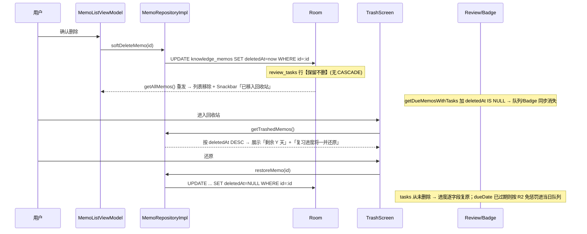
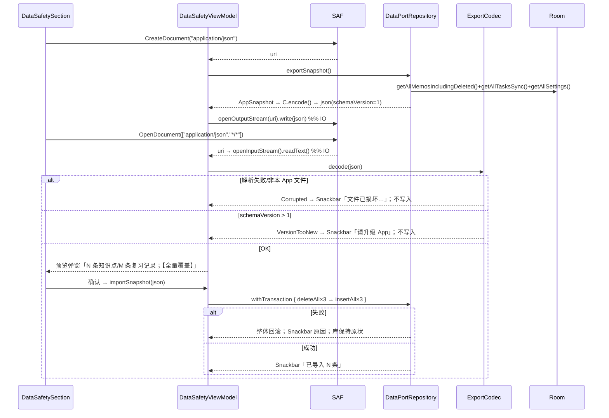
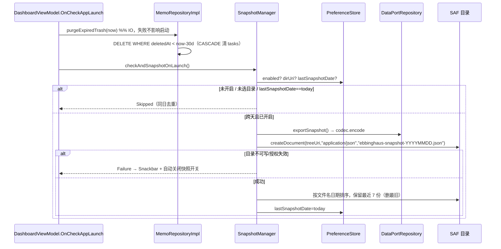

# 艾宾浩斯备忘录 · 增量架构设计与任务分解 V2

> v2.0 · 架构师：高见远 ｜ 输入：`PRD_INCREMENT_V2.md`(已批准)、`OPTIMIZATION_ROADMAP.md`、`ARCHITECTURE_INCREMENT.md`、`app/` 源码（逐文件实读）
> 范围：**E06/E10/E11/E01/E02 + Batch 3**，不含实现代码 ｜ 硬约束：`./gradlew test` 84 全绿；Manifest 零新增权限；sdk 35；release ≤+200 KB；不引 DI/WorkManager/Glance/ML Kit/adaptive

## 0. 现状勘察（读码所得，设计以此为准）

| # | 事实 | 证据 |
|---|---|---|
| 1 | `LocalDate` 落库为 **INTEGER(epochDay)**；`tags` 为**单列拼接串** `"\u001F"+join("\u001F")`（**前缀有分隔符、末尾无**），对 `§` 有 legacy fallback | `Converters.kt:38-46`、`Converters.kt:21-36` |
| 2 | `AppDatabase` = `version=1, exportSchema=false`，builder **无 fallback**；`room.schemaLocation` 已配但 `app/schemas` 不存在 | `AppDatabase.kt:26-27,42-52`；`app/build.gradle.kts:67` |
| 3 | 复习队列**唯一查询** `getDueMemosWithTasks`（INNER JOIN，无 deletedAt 过滤）；三处消费方**已共用**：复习页(`ReviewViewModel.kt:92`)、看板(`DashboardViewModel.kt:69,148`)、Badge(`AppNavigation.kt:156`) 均经 `ReviewRepositoryImpl.kt:18-20` | 同左 |
| 4 | 搜索是"全表加载+内存过滤"，DAO SQL `searchMemos` 为**死代码**；`getDueMemosWithTasksSync`/`getAllMemosWithTasks` 为**死方法** | `MemoRepositoryImpl.kt:38-54`；`KnowledgeMemoDao.kt:35-40`；`ReviewTaskDao.kt:48,56` |
| 5 | `EbbinghausApp.instance` 设值后**全项目零读取（死代码）**；`onCreate` 同步建库+3 仓储，`MainActivity.onCreate` 立即读取 | `EbbinghausApp.kt:33,45`；grep `.instance` 零命中；`MainActivity.kt:23-26` |
| 6 | `core/` **零 Android 依赖**（仅 `java.time`+`Regex`）；core 测试不依赖 `data/` | grep `androidx.\|android\.` 于 `core/` 零命中；`AdversarialM1StressTest.kt:1-11` |
| 7 | **测试用匿名 DAO 实现**（4 处）与 `FakeMemoRepository`/`PreviewMemoRepository` **逐方法实现接口** → 接口加抽象方法会**编译失败** | `DataLayerContractAdversarialTest.kt:234,246,309,322,359,372`；`FakeRepositories.kt:21-89`；`PreviewFakes.kt:27-92` |
| 8 | `MemoRepositoryImpl` 已具备 `database.withTransaction`（`createMemo` 在用）；无 `androidTest`、无 `.gitignore` | `MemoRepositoryImpl.kt:88-92`；`ls` 核实 |
| 9 | 单测共 **84**：core 31(4 文件)+data 11(1)+ui 42(9) | `grep -c @Test` 汇总 |

## 1. 实现方案总览与架构决策表

**总览**：以 E06 的 `deletedAt` 为**唯一 schema 变更**，先补 Room 迁移基础设施（`exportSchema=true`+`1.json` 基线+`Migration(1,2)`+迁移测试），再在**同一条 DAO 查询管线**上叠加「软删过滤+关键词 AND+标签+排序」，使列表/搜索/复习/Badge 四口径同源；导出/导入/快照复用**同一 `ExportCodec`**；偏好态（排序/快照开关/目录 URI）落 **SharedPreferences** 规避二次迁移；Batch 3 独立成任务。

| # | 决策 | 结论 | 理由 |
|---|---|---|---|
| D1 | `deletedAt` 类型 | `Long?`（epoch **毫秒**），列 **INTEGER** | 与 `createdAt/updatedAt` 同构（`KnowledgeMemoEntity.kt:23-24`）；`Long?` Room 原生映射，**无需新 TypeConverter**；迁移 SQL 与实体期望 schema 一致 |
| D2 | 迁移兜底 | **只加** `fallbackToDestructiveMigrationOnDowngrade()` | 降级兜底；**绝不**全量 `fallbackToDestructiveMigration()`（静默清库，PRD §5-14） |
| D3 | 迁移测试落点 | **必须 `androidTest`**（`MigrationTestHelper` 依赖 instrumentation+真实 SQLite，**不能纯 JVM 跑**）；**另加** JVM 兜底契约测试 | 环境无模拟器 → JVM 兜底守门（读 `2.json`+断言迁移 SQL 常量），androidTest 留待有设备 |
| D4 | 复习口径统一 | **仅改 1 条 SQL**：`getDueMemosWithTasks` 加 `AND knowledge_memos.deletedAt IS NULL` | 三处已共用（§0-3），改一处即三处生效 |
| D5 | 搜索+标签+排序 | **单条 DAO 查询**：`LEFT JOIN review_tasks`+`CASE WHEN :sortKey` 动态 `ORDER BY`；关键词**固定 6 元参数**(`k1..k6`，空串=不启用)表达 AND | 满足 PRD §4.5「同一查询管线」；单参排序避免 4 条重复 SQL；零拼接 SQL/防注入/可测 |
| D6 | 标签边界 | `(tags\|\|char(31)) LIKE '%'\|\|char(31)\|\|:tag\|\|char(31)\|\|'%'` | 列尾补分隔符覆盖「最后一个标签」；前后夹分隔符使 `tag1` **不**匹配 `tag10` |
| D7 | 偏好/SAF URI 持久化 | **`SharedPreferences`** | 存 `UserSettingsEntity` 触发**第二次迁移**（违背唯一迁移项）；DataStore 增依赖吃预算。SharedPreferences **零依赖零迁移**，URI 串天然适配 |
| D8 | JSON 编解码 | **`org.json`**（平台内置）+ 仅 `testImplementation("org.json:json")` | 运行时由 framework 提供 → **APK 零字节**；测试注入真实实现 → **纯 JVM 可测往返**。排除 serialization/Gson/Moshi（增体积） |
| D9 | 序列化格式 | `LocalDate`→**ISO-8601 `yyyy-MM-dd`**（无损）；时间戳→**epoch 毫秒 Long**；`tags`→**JSON 数组** | 可读、无时区漂移、往返逐字段相等、与存储格式解耦 |
| D10 | 快照目录 | `DocumentsContract`+`ContentResolver` 直接建文件，**不引** `androidx.documentfile` | 零新依赖 |
| D11 | 多选态与底栏 | `MemoListViewModel` 持选择态；`AppScaffold` 新增可选**操作栏插槽**替换底栏（Rail 断点置于 TopAppBar 下） | PRD §4.2/§4.5；选择态单一数据源，退出即清空 |
| D12 | `:core` 类型 | **纯 Kotlin JVM module**，包名 `com.ebbinghaus.memo.core.*` **不变** | §0-6 已证零 Android 依赖；包名不变 → **零 import churn** |
| D13 | 启动惰性化 | 4 属性改 `by lazy`；**删死代码 `instance`** | `onCreate` 不再建库/仓储；`instance` 零读取，删除零风险 |
| D14 | Baseline Profile | `profileinstaller:1.4.1` + `:baselineprofile`(com.android.test)；**无设备时降级**为「依赖+手写 `baseline-prof.txt`+文档化重录」 | 录制强依赖真机；本环境无法录制 → 必须兜底，禁止为凑指标加依赖（PRD §5-15） |

## 2. 文件清单

> `$APP=app/src/main/java/com/ebbinghaus/memo`；`$T=app/src/test/java/...`；`$AT=app/src/androidTest/java/...`；`$DBG=app/src/debug/java/...`

### 2.1 【新增】
| # | 路径 | 职责 |
|---|---|---|
| N1 | `core/build.gradle.kts` | `:core` 纯 Kotlin JVM 模块（toolchain 17） |
| N2 | `$APP/data/preference/PreferenceStore.kt` | SharedPreferences 封装：排序/快照开关/目录 URI/保留数/上次快照日 |
| N3 | `$APP/data/export/ExportModels.kt` | `AppSnapshot`/`MemoDto`/`ReviewTaskDto`/`SettingsDto` 传输对象 |
| N4 | `$APP/data/export/ExportCodec.kt` | `encode(AppSnapshot):String`/`decode(String):Result<AppSnapshot>`，含 `schemaVersion` 校验 |
| N5 | `$APP/data/export/DataPortRepository.kt` | 导出编排 + 导入编排（解析校验→单事务全量覆盖） |
| N6 | `$APP/data/snapshot/SnapshotManager.kt` | 启动检查+同日去重+写 SAF 目录+保留 7 份+`snapshotNow()` |
| N7 | `$APP/data/trash/TrashRetention.kt` | 保留常量(30 天)+`purgeCutoff(now)`（纯函数） |
| N8 | `$APP/ui/trash/TrashViewModel.kt` | 回收站列表/还原/立即物理删除/清空 |
| N9 | `$APP/ui/trash/TrashScreen.kt` | 回收站下钻页（剩余天数、还原、清空二次确认、「进度一并还原」提示） |
| N10 | `$APP/ui/component/SortBottomSheet.kt` | 排序底部弹窗（4 选项单选，点击即生效） |
| N11 | `$APP/ui/component/SelectionActionBar.kt` | 多选操作栏（已选 N 条/删除/打标签/全选/关闭） |
| N12 | `$APP/ui/component/TagPickerDialog.kt` | 批量打标签弹窗（输入+候选，去重合并） |
| N13 | `$APP/ui/settings/DataSafetySection.kt` | 设置页「数据与安全」分组（导出/导入/快照/回收站入口+SAF 启动器） |
| N14 | `$APP/ui/settings/DataSafetyViewModel.kt` | 导出/导入/快照 UI 状态与事件（不污染已测 `SettingsViewModel`） |
| N15 | `app/schemas/.../AppDatabase/1.json` | **v1 基线 schema**（改实体前生成入库） |
| N16 | `app/schemas/.../AppDatabase/2.json` | **v2 schema**（含 `deletedAt`） |
| N17 | `$AT/data/local/MigrationTest.kt` | `MigrationTestHelper` 断言 1→2 不丢数据、`deletedAt` 全 NULL、tasks 保留 |
| N18 | `$T/data/SchemaV2ContractTest.kt` | JVM 兜底：读 `2.json` 断言 `deletedAt` 为 INTEGER 且 nullable；断言迁移 SQL 常量 |
| N19 | `$T/data/ExportCodecRoundTripTest.kt` | JVM 往返逐字段相等；空库合法；高版本/损坏拒绝 |
| N20 | `$T/ui/TrashRetentionTest.kt` | JVM：30 天 cutoff、边界日、保留裁剪顺序 |
| N21 | `app/src/main/baseline-prof.txt` | Baseline Profile（无设备时手写最小集） |
| N22 | `baselineprofile/build.gradle.kts` | Macrobenchmark 模块（`com.android.test`，targetProjectPath=`:app`） |
| N23 | `baselineprofile/.../StartupBenchmark.kt` | 冷启动关键路径录制（`StartupTimingMetric`） |

### 2.2 【修改】
| # | 路径 | 改动摘要 |
|---|---|---|
| M1 | `settings.gradle.kts` | `include(":core")`、`include(":baselineprofile")` |
| M2 | `build.gradle.kts`(根) | 增 `kotlin.jvm`/`androidx.baselineprofile`/`com.android.test` 插件版本(`apply false`) |
| M3 | `app/build.gradle.kts` | `implementation(project(":core"))`、`profileinstaller`、`testImplementation(org.json)`、`androidTestImplementation(room-testing/runner/core/junit)`、`baselineProfile(project(":baselineprofile"))` |
| M4 | `$APP/data/local/AppDatabase.kt` | `exportSchema=true`、`version=2`、`addMigrations(MIGRATION_1_2)`、`fallbackToDestructiveMigrationOnDowngrade()`、保留 `addCallback` |
| M5 | `$APP/data/local/entity/KnowledgeMemoEntity.kt` | 末尾追加 `val deletedAt: Long? = null`（带默认值，构造点零破坏） |
| M6 | `$APP/data/local/dao/KnowledgeMemoDao.kt` | 查询加 `deletedAt IS NULL`；新增软删/还原/回收站/清空/批量/导出用方法（§3.2） |
| M7 | `$APP/data/local/dao/ReviewTaskDao.kt` | `getDueMemosWithTasks` 加 `AND knowledge_memos.deletedAt IS NULL`；新增导出用 `getAllTasksSync/insertAll/deleteAll` |
| M8 | `$APP/data/local/dao/UserSettingsDao.kt` | 新增导出用 `getAllSettings/insertAll/deleteAll` |
| M9 | `$APP/data/repository/MemoRepository.kt` | 新增软删/还原/回收站/批量/排序重载/导出读取方法（§3.3） |
| M10 | `$APP/data/repository/MemoRepositoryImpl.kt` | 实现新方法；`searchMemos(query,tag,sort)` 走 DAO 管线；批量打标签走 `withTransaction` |
| M11 | `$APP/data/repository/ReviewRepository.kt`+`Impl.kt` | 新增导出用 `getAllTasksSync()` |
| M12 | `$APP/ui/memolist/MemoListViewModel.kt` | 新增排序态/多选态/批量事件/排序持久化；搜索走新管线 |
| M13 | `$APP/ui/memolist/MemoListScreen.kt` | TopAppBar 排序入口；长按进多选；多选态置灰搜索/标签栏；选中高亮 |
| M14 | `$APP/ui/scaffold/AppScaffold.kt` | 新增可选 `selectionBar` 插槽（Compact 替换底栏；Rail 断点置顶） |
| M15 | `$APP/ui/navigation/AppNavigation.kt` | 接入 Trash 路由、DataSafety VM、多选态与 AppScaffold 桥接 |
| M16 | `$APP/ui/navigation/Screen.kt` | 新增 `Trash` 路由（不计入 `isTopLevel`） |
| M17 | `$APP/ui/settings/SettingsScreen.kt` | 插入「数据与安全」分组 |
| M18 | `$APP/EbbinghausApp.kt` | 4 属性改 `by lazy`；暴露 `preferenceStore`/`dataPortRepository`/`snapshotManager`；**删 `instance`** |
| M19 | `$APP/MainActivity.kt` | 透传新增依赖（惰性读取，不破坏首帧） |
| M20 | `$T/ui/FakeRepositories.kt` | `FakeMemoRepository` 补齐新接口方法（内存软删/排序/批量） |
| M21 | `$DBG/ui/preview/PreviewFakes.kt` | `PreviewMemoRepository` 补齐新接口方法 |
| M22 | `$T/data/DataLayerContractAdversarialTest.kt` | 4 处匿名 DAO 对象补齐新增方法 **stub 覆写**（否则整模块编译失败，§0-7） |

### 2.3 【删除】（迁入 `:core`）
| # | 路径 | 去向 |
|---|---|---|
| X1 | `$APP/core/**`（9 文件） | → `core/src/main/kotlin/com/ebbinghaus/memo/core/**`（**包名不变**） |
| X2 | `$T/core/**`（4 文件/31 测试） | → `core/src/test/kotlin/com/ebbinghaus/memo/core/**` |

## 3. 数据模型与接口设计

### 3.1 Entity 变更
```kotlin
// KnowledgeMemoEntity.kt：仅在 updatedAt 之后追加一行
val updatedAt: Long = System.currentTimeMillis(),
val deletedAt: Long? = null        // 🆕 null=存活；非 null=回收站（epoch 毫秒）
```

### 3.2 DAO 签名与 SQL
```kotlin
// KnowledgeMemoDao
@Query("SELECT * FROM knowledge_memos WHERE deletedAt IS NULL ORDER BY updatedAt DESC")
fun getAllMemos(): Flow<List<KnowledgeMemoEntity>>                                   // 修改
@Query("UPDATE knowledge_memos SET deletedAt = :deletedAt WHERE id = :id")
suspend fun softDeleteById(id: Long, deletedAt: Long)                                 // 新增
@Query("UPDATE knowledge_memos SET deletedAt = :deletedAt WHERE id IN (:ids)")
suspend fun softDeleteByIds(ids: List<Long>, deletedAt: Long)                         // 新增
@Query("UPDATE knowledge_memos SET deletedAt = NULL WHERE id = :id")
suspend fun restoreById(id: Long)                                                     // 新增
@Query("DELETE FROM knowledge_memos WHERE deletedAt IS NOT NULL AND deletedAt < :cutoff")
suspend fun purgeTrashedBefore(cutoff: Long)      // 新增；CASCADE 连带清 review_tasks
@Query("DELETE FROM knowledge_memos WHERE deletedAt IS NOT NULL")
suspend fun clearTrash()                                                              // 新增
@Query("SELECT * FROM knowledge_memos WHERE deletedAt IS NOT NULL ORDER BY deletedAt DESC")
fun getTrashedMemos(): Flow<List<KnowledgeMemoEntity>>                                // 新增
@Query("SELECT * FROM knowledge_memos WHERE id IN (:ids)")
suspend fun getMemosByIds(ids: List<Long>): List<KnowledgeMemoEntity>                 // 新增
@Query("SELECT * FROM knowledge_memos")
suspend fun getAllMemosIncludingDeleted(): List<KnowledgeMemoEntity>                  // 新增（含软删，往返完整）
@Insert(onConflict = OnConflictStrategy.REPLACE)
suspend fun insertAll(memos: List<KnowledgeMemoEntity>)                               // 新增
@Query("DELETE FROM knowledge_memos")
suspend fun deleteAllMemos()                                                          // 新增
// 新增：统一查询管线（替换原死代码 searchMemos(keyword)）
@Query("""
SELECT m.* FROM knowledge_memos m LEFT JOIN review_tasks t ON m.id = t.memoId
WHERE m.deletedAt IS NULL
  AND (:tag IS NULL OR (m.tags || char(31)) LIKE '%' || char(31) || :tag || char(31) || '%')
  AND (:k1 = '' OR m.content LIKE '%'||:k1||'%' OR m.notes LIKE '%'||:k1||'%')
  AND (:k2 = '' OR m.content LIKE '%'||:k2||'%' OR m.notes LIKE '%'||:k2||'%')
  AND (:k3 = '' OR m.content LIKE '%'||:k3||'%' OR m.notes LIKE '%'||:k3||'%')
  AND (:k4 = '' OR m.content LIKE '%'||:k4||'%' OR m.notes LIKE '%'||:k4||'%')
  AND (:k5 = '' OR m.content LIKE '%'||:k5||'%' OR m.notes LIKE '%'||:k5||'%')
  AND (:k6 = '' OR m.content LIKE '%'||:k6||'%' OR m.notes LIKE '%'||:k6||'%')
ORDER BY CASE WHEN :sortKey = 0 THEN m.createdAt END DESC,
         CASE WHEN :sortKey = 1 THEN m.updatedAt END DESC,
         CASE WHEN :sortKey = 2 THEN COALESCE(t.stageLevel, 0) END DESC,
         CASE WHEN :sortKey = 3 THEN COALESCE(t.dueDate, 9999999) END ASC,
         m.id DESC
""")
fun searchMemos(k1:String,k2:String,k3:String,k4:String,k5:String,k6:String,
                tag:String?, sortKey:Int): Flow<List<KnowledgeMemoEntity>>

// ReviewTaskDao（唯一 SQL 修改 = 三处口径同源）
@Transaction @Query("""
  SELECT knowledge_memos.* FROM knowledge_memos
  INNER JOIN review_tasks ON knowledge_memos.id = review_tasks.memoId
  WHERE review_tasks.dueDate <= :targetDate
    AND knowledge_memos.deletedAt IS NULL        -- 🆕 软删条目从复习队列/Badge 一并消失
  ORDER BY review_tasks.dueDate ASC, review_tasks.id ASC
""")
fun getDueMemosWithTasks(targetDate: LocalDate): Flow<List<MemoWithReviewTask>>
// UserSettingsDao 另增：getAllSettings():List<UserSettingsEntity>/insertAll/deleteAll
```

### 3.3 Repository 增量
```kotlin
enum class MemoSortOption { CREATED_DESC, UPDATED_DESC, STAGE_DESC, DUE_ASC } // ordinal 即 sortKey
// MemoRepository
fun searchMemos(query: String, tag: String?, sort: MemoSortOption): Flow<List<KnowledgeMemoEntity>>
suspend fun softDeleteMemo(id: Long); suspend fun softDeleteMemos(ids: List<Long>)   // 单事务
suspend fun restoreMemo(id: Long); suspend fun hardDeleteMemo(id: Long); suspend fun clearTrash()
fun getTrashedMemos(): Flow<List<KnowledgeMemoEntity>>
suspend fun purgeExpiredTrash(nowMillis: Long)
suspend fun addTagToMemos(ids: List<Long>, tag: String)                              // 单事务+去重合并
suspend fun getAllMemosIncludingDeleted(): List<KnowledgeMemoEntity>
// DataPortRepository（新增）
class DataPortRepository(private val db: AppDatabase, private val codec: ExportCodec) {
    suspend fun exportSnapshot(): AppSnapshot
    suspend fun importSnapshot(json: String): ImportResult   // decode→校验→单事务全量覆盖
}
sealed interface ImportResult {
    data class Success(val memoCount: Int, val taskCount: Int) : ImportResult
    data object CorruptedFile : ImportResult       // 解析失败/非本 App 文件
    data object VersionTooNew : ImportResult       // schemaVersion > 1
}
```

### 3.4 导出 JSON schema（`schemaVersion` 起始 1；**导出/导入共用同一 codec**）
```jsonc
{
  "schemaVersion": 1,              // 根级；>1 一律拒绝
  "exportedAt": 1737000000000,     // epoch 毫秒（仅信息）
  "appVersion": "1.0.0",
  "memos": [{
    "id": 1, "content": "…", "notes": "…",
    "tags": ["算法","信息论"],      // JSON 数组（与 U+001F 存储解耦）
    "createdAt": 1736900000000, "updatedAt": 1736900000000,
    "deletedAt": null              // epoch 毫秒 或 null
  }],
  "reviewTasks": [{
    "id": 1, "memoId": 1, "stageLevel": 1,
    "dueDate": "2025-01-16",       // LocalDate → ISO-8601
    "lastReviewDate": null, "reviewCount": 0, "updatedAt": 1736900000000
  }],
  "userSettings": { "id": 1, "dailyReviewLimit": 20,
    "lastActiveDate": null, "lastPromptedDate": null }   // 空库时为 null
}
```
约定：① `tags` 必为数组（空数组合法）；② 空库导出产出合法空结构（`memos:[]`、`reviewTasks:[]`、`userSettings:null`）**不报错**；③ 导入**先全量 `decode` 校验、后落库**，落库在 `db.withTransaction { deleteAll×3 → insertAll×3 }` **单事务**内，任一步失败整体回滚。

### 3.5 SAF 交互接口（Manifest 零新增权限）
| 能力 | Contract | 接入点 | 备注 |
|---|---|---|---|
| 导出 | `CreateDocument("application/json")` | `DataSafetySection` 内 `rememberLauncherForActivityResult` → 默认名 `ebbinghaus-YYYYMMDD.json` | `openOutputStream(uri)`，**IO 分派器** |
| 导入 | `OpenDocument(arrayOf("application/json","*/*"))` | 同上 → 先 `decode` → **预览弹窗**（条数+全量覆盖警示）→ 确认落库 | 取消选择静默返回 |
| 快照目录 | `OpenDocumentTree` | 同上 → `takePersistableUriPermission(uri, READ|WRITE)` | **URI 串存 SharedPreferences**(D7)；写入用 `DocumentsContract.createDocument(buildDocumentUriUsingTree(treeUri, getTreeDocumentId(treeUri)), "application/json", name)` |

## 4. 类图

```mermaid
classDiagram
    class KnowledgeMemoEntity { +Long id +String content +String notes +List~String~ tags +Long createdAt +Long updatedAt +Long? deletedAt }
    class MemoSortOption { <<enumeration>> CREATED_DESC UPDATED_DESC STAGE_DESC DUE_ASC }
    class KnowledgeMemoDao {
        +getAllMemos() Flow
        +searchMemos(k1..k6, tag, sortKey) Flow
        +softDeleteById(id,deletedAt) +softDeleteByIds(ids,deletedAt)
        +restoreById(id) +purgeTrashedBefore(cutoff) +clearTrash()
        +getTrashedMemos() Flow +getMemosByIds(ids) List
        +getAllMemosIncludingDeleted() List +insertAll(memos) +deleteAllMemos()
    }
    class ReviewTaskDao { +getDueMemosWithTasks(targetDate) Flow +getAllTasksSync() List +insertAll(list) +deleteAll() }
    class MemoRepository { <<interface>> +searchMemos(query,tag,sort) Flow +softDeleteMemo(id) +softDeleteMemos(ids) +restoreMemo(id) +hardDeleteMemo(id) +clearTrash() +getTrashedMemos() Flow +purgeExpiredTrash(now) +addTagToMemos(ids,tag) }
    class MemoRepositoryImpl
    class ExportCodec { +encode(AppSnapshot) String +decode(String) Result~AppSnapshot~ }
    class AppSnapshot { +Int schemaVersion +Long exportedAt +List~MemoDto~ memos +List~ReviewTaskDto~ reviewTasks +SettingsDto? userSettings }
    class DataPortRepository { +exportSnapshot() AppSnapshot +importSnapshot(json) ImportResult }
    class SnapshotManager { +checkAndSnapshotOnLaunch() +snapshotNow() +pruneTo(keep) }
    class PreferenceStore { +sortOption Flow +snapshotEnabled Flow +snapshotDirUri +lastSnapshotDate }
    class TrashRetention { <<object>> +RETENTION_DAYS=30 +purgeCutoff(now) Long }
    class MemoListViewModel { +uiState +effect +onEvent(event) }
    class TrashViewModel { +uiState +onEvent(event) }
    class DataSafetyViewModel { +uiState +effect +onEvent(event) }
    MemoRepository <|.. MemoRepositoryImpl
    MemoRepositoryImpl --> KnowledgeMemoDao
    MemoRepositoryImpl --> AppDatabase
    DataPortRepository --> ExportCodec
    DataPortRepository --> AppDatabase
    ExportCodec --> AppSnapshot
    SnapshotManager --> DataPortRepository
    SnapshotManager --> PreferenceStore
    SnapshotManager --> TrashRetention
    MemoListViewModel --> MemoRepository
    MemoListViewModel --> PreferenceStore
    TrashViewModel --> MemoRepository
    DataSafetyViewModel --> DataPortRepository
    DataSafetyViewModel --> SnapshotManager
    DataSafetyViewModel --> PreferenceStore
```


## 5. 关键流程时序图

### 5.1 软删除 → 回收站 → 还原（E06）


### 5.2 导出 → 导入往返（E01）


### 5.3 启动：快照检查 + 过期回收站清理（E02+E06）


## 6. 任务列表（有序 · 含依赖 · 按实现顺序）

| 编号 | 任务 | 涉及文件 | 依赖 | 验收标准 |
|---|---|---|---|---|
| **T01** | **项目基础设施**：`:core` 模块化 + 构建/依赖声明 + 启动惰性化 | N1、M1~M3、M18、M19、X1、X2 | 无 | `:core` 独立 module 且 `./gradlew :core:test` 独立通过(31)；`./gradlew test` 仍 **84 passed**；`core/` 零 `androidx.*`；包名不变零 import churn；`onCreate` 不再建库/仓储；`instance` 死代码已删 |
| **T02** | **数据层**：Room v1→v2 迁移 + 软删除 + 复习口径同源 + 迁移测试 | N15~N18、M4~M8、M20~M22 | T01 | `1.json`/`2.json` 入库；`exportSchema=true`；`Migration(1,2)` 仅 `ALTER TABLE knowledge_memos ADD COLUMN deletedAt INTEGER`；仅 `fallbackToDestructiveMigrationOnDowngrade()`；`getDueMemosWithTasks` 含 `deletedAt IS NULL`；JVM 兜底契约测试绿；**84 全绿** |
| **T03** | **列表管线 + 排序 + 回收站**（E10 + E06 表现层） | N2、N7~N10、N20、M9~M12、M16 | T02 | 四种排序确定性首元素序列；排序重启保持；切换排序不清空搜索/标签；回收站按 `deletedAt DESC`+剩余天数；还原后逐字段等于删除前；空态复用 `EmptyState` |
| **T04** | **批量多选 + 导出/导入/快照数据层**（E11 + E01/E02 数据面） | N3~N6、N11、N12、N19、M10、M13~M15 | T03 | 长按进多选、已选 N 条、全选/取消/退出清空；批量删除单事务且均可还原；批量打标签去重合并；往返逐字段相等；空库导出合法；高版本/损坏拒绝且不写入；单事务全量覆盖 |
| **T05** | **导出/导入/快照 UI + Baseline Profile + 集成回归** | N13、N14、N21~N23、M3、M15、M17 | T04 | 设置页「数据与安全」四入口可用且零权限；预览弹窗含覆盖警示；快照失败提示且自动关开关；「立即快照一次」可用；release ≤+200 KB；`baseline-prof.txt` 入库；**84 全绿 + 零告警** |

**T01 子步骤**：① 新建 `core/build.gradle.kts`（`kotlin("jvm")`+`jvmToolchain(17)`+junit）；② 根 `build.gradle.kts` 增 `kotlin.jvm 2.0.21 apply false`；③ `settings.gradle.kts` 增 `include(":core")`；④ **移动**（不改包名）`$APP/core/**`→`core/src/main/kotlin/...`、`$T/core/**`→`core/src/test/kotlin/...`，删除 app 内已空 `core/` 目录；⑤ `app/build.gradle.kts` 增 `implementation(project(":core"))`；⑥ `EbbinghausApp` 4 属性改 `by lazy { … }`、`onCreate` 仅 `super.onCreate()`、**删 companion `instance`**；⑦ `./gradlew :core:test` + `./gradlew test` 双绿。

**T02 子步骤**：① **先**在实体/版本未改时把 `exportSchema` 改 `true`，跑 `./gradlew :app:kspDebugKotlin` 生成并提交 `1.json`（**顺序不可颠倒**）；② `KnowledgeMemoEntity` 追加 `deletedAt: Long? = null`；`AppDatabase` 改 `version=2`，新增 `MIGRATION_1_2 = object : Migration(1,2){ override fun migrate(db){ db.execSQL("ALTER TABLE knowledge_memos ADD COLUMN deletedAt INTEGER") } }`，`addMigrations(MIGRATION_1_2).fallbackToDestructiveMigrationOnDowngrade()`；③ 生成 `2.json` 入库；④ 实现 §3.2 全部 DAO；`getDueMemosWithTasks` 加 `deletedAt IS NULL`；⑤ 实现 §3.3 Repository；⑥ **补齐测试替身**（`FakeRepositories`/`PreviewFakes`/`DataLayerContractAdversarialTest` 4 处匿名 DAO）；⑦ 新增 `MigrationTest`(androidTest)+`SchemaV2ContractTest`(JVM)。

**T03 子步骤**：① 新增 `MemoSortOption`+`PreferenceStore`（`sortOption` 读写）；② `MemoRepositoryImpl.searchMemos(query,tag,sort)`：`query.split("\\s+")` 取前 6 词、空位补 `""` 调 DAO 管线；③ `MemoListViewModel` 增 `sortOption` 态+`OnSortOptionSelected`+持久化，`observeMemos` 的 `combine` 加入 `_sortOption`；④ 新增 `SortBottomSheet` 并接入 TopAppBar（`Icons.AutoMirrored.Filled.Sort`）；⑤ 新增 `TrashRetention`+`TrashViewModel`+`TrashScreen`+`Screen.Trash` 路由+设置页入口；⑥ 新增 `TrashRetentionTest`。

**T04 子步骤**：① `MemoListViewModel` 增 `isSelectionMode`/`selectedIds` 与事件 `OnEnterSelectionMode/OnToggleSelection/OnSelectAll/OnClearSelection/OnExitSelectionMode/OnBatchDelete/OnBatchAddTag`，操作后自动退出多选并 Snackbar；② `MemoListScreen`：长按进多选、多选态 `enabled=false` 置灰搜索/标签、选中项 `primaryContainer`+Checkbox；③ `AppScaffold` 增 `selectionBar: (@Composable () -> Unit)?`（非 null 时 Compact 替换底栏，Rail 断点置顶）；④ 新增 `SelectionActionBar`+`TagPickerDialog`；⑤ 新增 `ExportModels`+`ExportCodec`(org.json，`decode` 先校验 `schemaVersion`)+`DataPortRepository`（单事务全量覆盖）；⑥ 新增 `SnapshotManager`；⑦ 新增 `ExportCodecRoundTripTest`。

**T05 子步骤**：① 新增 `DataSafetyViewModel`+`DataSafetySection`（三个 `rememberLauncherForActivityResult`、预览弹窗、Snackbar 区分损坏/版本/不可写/授权失效）；② `SettingsScreen` 插「数据与安全」分组；③ `app/build.gradle.kts` 增 `profileinstaller`+`baselineProfile(project(":baselineprofile"))`；④ 新建 `:baselineprofile` 模块+`StartupBenchmark`，有设备时 `./gradlew :baselineprofile:pmp` 生成并入库 `baseline-prof.txt`，**无设备时提交手写最小 profile**；⑤ 回归：`./gradlew test`(84)+`assembleRelease`(≤基线+200 KB)+`lint`(零告警)。

## 7. 依赖包列表（逐个论证；非必需一律不引入）

| 依赖 | 版本 | Scope | 必要性 | APK 增幅 |
|---|---|---|---|---|
| `androidx.profileinstaller:profileinstaller` | 1.4.1 | implementation | **必需**：Baseline Profile 安装器，缺它 profile 不生效 | ~15 KB |
| `org.json:json` | 20240303 | **testImplementation** | **必需**：让 codec 纯 JVM 往返可测；运行时由 Android framework 提供 | **0** |
| `androidx.room:room-testing` | 2.6.1 | androidTestImplementation | **必需**：`MigrationTestHelper` 唯一来源 | 0 |
| `androidx.test:runner`/`core`/`ext:junit` | 1.6.2/1.6.1/1.2.1 | androidTestImplementation | **必需**：androidTest 运行器 | 0 |
| `androidx.benchmark:benchmark-macro-junit4` | 1.3.3 | baselineprofile 模块 | **必需**：`StartupTimingMetric` 采集 | 0 |
| `com.android.test`+`androidx.baselineprofile` 插件 | 8.7.3/1.3.3 | 构建期 | **必需**：生成 `baseline-prof.txt` | 0 |

**明确拒绝**：`kotlinx-serialization-json`/`Gson`/`Moshi`（增体积，`org.json` 已覆盖）；`androidx.datastore`（D7 用 SharedPreferences）；`androidx.documentfile`（`DocumentsContract` 已覆盖）；`WorkManager`/`Hilt`/`Koin`/`Glance`/`ML Kit`（PRD 红线）。

## 8. 共享知识（跨文件约定）
1. **调度**：所有 IO（SAF 读写、DB 事务、快照、清理）走 `Dispatchers.IO`；纯计算走 `Default`；VM 一律 `viewModelScope.launch`，禁主线程做文件/DB。
2. **错误处理**：数据层不抛到 UI；Repository 返回 `Result<T>` 或具名 `sealed`（如 `ImportResult`）；VM 转 `XxxEffect.ShowSnackbar`，文案必须区分「文件损坏/版本不兼容/目录不可写/URI 授权失效」四类，**均不崩溃**。
3. **`Result` 约定**：`ExportCodec.decode` 返 `Result<AppSnapshot>`（Failure 携带 Corrupt/VersionTooNew 语义）；导入**先全量解析校验、后落库**，落库单事务。
4. **软删除口径**：任何列表/搜索/复习/Badge 查询**必须**带 `deletedAt IS NULL`；回收站是独立域（`IS NOT NULL`）且**不复用**列表页搜索/标签态；删除=软删，`review_tasks` **绝不**随软删删除。
5. **排序口径**：`MemoSortOption.ordinal` 即 DAO `sortKey`；排序只改 `ORDER BY` 不参与过滤；排序为 `MemoListViewModel` 单点持有，单列/双窗格共享。
6. **偏好持久化**：一切 UI 偏好与 SAF URI 落 `SharedPreferences`(`PreferenceStore`)；**禁止**为偏好新增 Room 列/表。
7. **Compose 状态**：`XxxUiState` 为不可变 `data class`，**新增字段必须带默认值**；交互统一 `onEvent(XxxUiEvent)`；一次性消息走 `SharedFlow<XxxEffect>(replay=0, extraBufferCapacity=1)`；Snackbar 只用 `LocalSnackbarHostState`，Screen **不得**自建 `SnackbarHost`。
8. **命名**：`XxxScreen`(含 Scaffold)/`XxxContent`(纯内容)/`XxxViewModel`/`XxxEffect`；事件 `On`+动词；DAO `softDelete*`/`restore*`/`purge*`/`search*`。
9. **文案**：中文硬编码于 Composable（与现网一致）；禁「逾期/失败/落后」，统一「顺延/待复习/已移入回收站」；回收站必示「复习进度将一并还原」。
10. **颜色/尺寸**：一律 `MaterialTheme.colorScheme.*` 与 `Dimens`；「剩余天数」用 `outline`，不用 error 红。

## 9. 风险与待明确事项

| # | 事项 | 级别 | 说明与建议 |
|---|---|---|---|
| R1 | **测试替身必须同步补齐**（最易踩坑） | 🔴 | 新增 DAO 抽象方法会使 `DataLayerContractAdversarialTest.kt` 4 处匿名对象编译失败；新增 `MemoRepository` 方法会使 `FakeRepositories`/`PreviewFakes` 编译失败。**必须先补齐替身再跑 test**，否则 84 全红。 |
| R2 | **`1.json` 生成顺序** | 🔴 | 必须先在「`exportSchema=true` 且实体/版本未改」时生成 v1 基线，再改 v2。顺序颠倒将永久丢失 v1 基线，迁移测试无从对齐。 |
| R3 | **`MigrationTestHelper` 无法 JVM 运行** | 🔴 | 已核实：依赖 instrumentation+真实 SQLite，**只能 androidTest**。环境无模拟器 → 交付 JVM 兜底契约测试；androidTest 用例保留待有设备执行。若要求「JVM 必跑迁移」，需引入 Robolectric（**新依赖**，需拍板）。 |
| R4 | **关键词固定 6 元** | 🟡 | 超 6 词部分被忽略（VM 截断）。若需无上限 AND，须动态 SQL（注入风险）或 FTS。建议接受并文档化。 |
| R5 | **`org.json` 在 JVM 单测类路径** | 🟡 | `testImplementation("org.json:json")` 为通行做法；若遇 mockable android.jar 的 `org.json` stub 冲突，需确认 test 类路径优先真实 jar。**兜底**：改用 `kotlinx-serialization`（+体积）或 `core/` 内手写极简 JSON。 |
| R6 | **Baseline Profile 无设备** | 🟠 | 本环境无法录制。降级为「依赖+手写最小 `baseline-prof.txt`+文档化重录命令」；冷启动「≥15%」指标在无设备时**无法验收**，需明示。 |
| R7 | **软删条目从标签栏消失** | 🟢 | `allTags` 由 `getAllMemos()` 派生，现排除软删 → 仅存于回收站的标签不再出现在筛选栏。语义合理；如需保留须另加查询。 |
| R8 | **legacy `§` 标签筛选** | 🟢 | 新写入一律 `U+001F`，LIKE 仅匹配 `char(31)`；历史 `§` 数据（v1 无历史）可能不中，属可接受边界。 |
| R9 | **`:core` 移动后残留** | 🟢 | 首次迁移须删除 app 内已空的 `core/` 目录，否则可能重复类。 |
| R10 | **快照与导入并发** | 🟡 | 建议 `DataPortRepository` 内用单一 `Mutex` 串行化导出/导入，避免读到半更新数据。 |
| R11 | **`purgeExpiredTrash` 触发点** | 🟢 | 复用 `OnCheckAppLaunch` 的同日去重检查；跨天首次进入执行，IO 线程，失败仅记录不阻断启动。 |

> **交付口径**：全文基于实读源码；未修改任何既有文件；实现与验收交给工程师按 §6 顺序推进。
