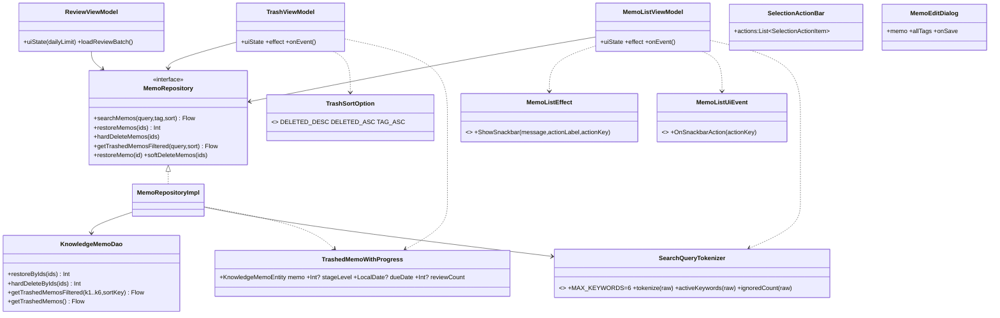
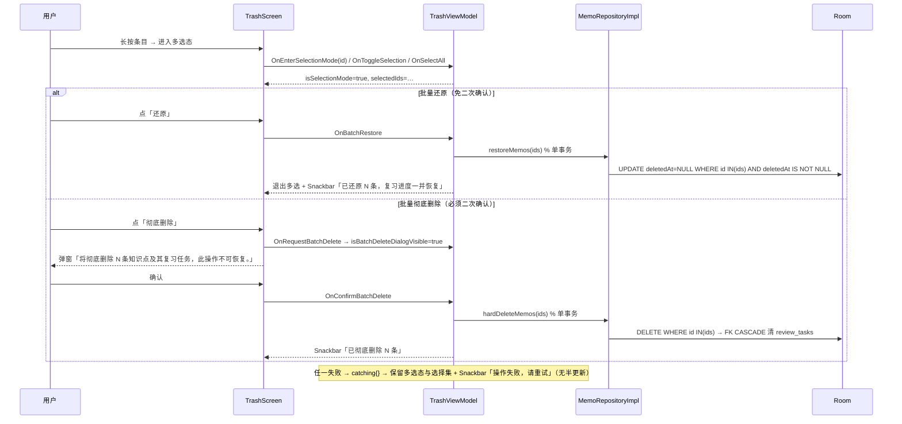
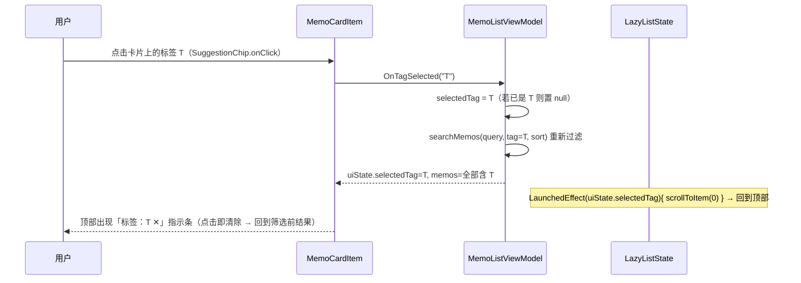

# 艾宾浩斯备忘录 · 增量架构设计与任务分解 V3

> v3.0 · 架构师：高见远 ｜ 输入：`PRD_INCREMENT_V3.md`(已批准)、`app/`+`core/` 源码（逐文件实读）
> 范围：**P2-1 ~ P2-10**，不含实现代码 ｜ 硬约束：`./gradlew test` 保持 **175 passed**（只增不改）；Manifest 零新增权限；**零新增依赖**；compileSdk/targetSdk 保持 **35**；**无 Room schema 变更**；release ≤ +100 KB

## 0. 现状勘察（读码所得，设计以此为准）

| # | 事实 | 证据 |
|---|---|---|
| 1 | Snackbar 通道为纯数据 Effect：`ShowSnackbar(message)`，UI 侧 `showSnackbar(effect.message)`，**全项目无 `actionLabel`/`withDismissAction`** | `MemoListViewModel.kt:137`、`MemoListScreen.kt:301-307`；grep `actionLabel` 仅命中 `EmptyState` |
| 2 | 列表页删除走 `OnRequestDeleteMemo→OnConfirmDeleteMemo`（软删+Snackbar）；`OnDeleteMemo` 为「立即删除」语义（被单测依赖，**不得改**） | `MemoListViewModel.kt:74-84,319-367`；`MemoListViewModelTest.kt:95-109` |
| 3 | `restoreMemo(id)` 仅 `UPDATE deletedAt=NULL`，**不触碰 content/notes/tags** | `MemoRepositoryImpl.kt:132-134`；`KnowledgeMemoDao.kt:54-55` |
| 4 | 回收站查询 `getTrashedMemos()` 返回 `Flow<List<KnowledgeMemoEntity>>`，**不含复习进度**（进度在 `review_tasks`）；软删条目 `review_tasks` 行**保留**（无 CASCADE） | `KnowledgeMemoDao.kt:63-64` |
| 5 | 复习任务与知识点 **1:1**（`Index(memoId, unique)` + `onDelete=CASCADE`），FK 已在 `onOpen` 显式开启 | `ReviewTaskEntity.kt:22-36`；`AppDatabase.kt:65-70` |
| 6 | 列表搜索管线固定 **6 元参数** `k1..k6`（空串=不启用，AND），搜索范围 = **content + notes**（**不含 tags**） | `KnowledgeMemoDao.kt:85-113` |
| 7 | UI 高亮切分 `searchQuery.split(" ", "　")`（**与仓储 `\s+` 不一致**） | `MemoListScreen.kt:330-332`；`MemoRepositoryImpl.kt:45` |
| 8 | 标签 Chip `SuggestionChip(onClick = {})` = 交互死区；点击标签本质即设置 `selectedTag`（`OnTagSelected` 自带「再点取消」） | `MemoListScreen.kt:796-806`；`MemoListViewModel.kt:242-247` |
| 9 | 列表页多选态：`MemoListViewModel` 持 `isSelectionMode/selectedIds`；底栏 `SelectionActionBar` 四操作硬编码（删除/打标签/全选/关闭）；`BackHandler` 已上提 `AppNavigation`，`enabled = 列表路由 && 多选态` | `MemoListViewModel.kt:400-451`；`SelectionActionBar.kt:44-94`；`AppNavigation.kt:188-192` |
| 10 | `TrashViewModel` **在 Trash 路由内**用 `viewModel(factory)` 创建（顶层 BackHandler 取不到其状态）；`TrashUiState.items: List<KnowledgeMemoEntity>` | `AppNavigation.kt:397-409`；`TrashViewModel.kt:21-31` |
| 11 | `MemoEditDialog(memo,onDismiss,onSave)` 只收 `memo`，标签区为纯文本框（`split(",","，","、"," ")`）；调用点 `MemoListScreen.kt:483-489` | `MemoEditDialog.kt:64-100` |
| 12 | `ReviewUiState` **无 `dailyLimit`**；`ReviewViewModel.loadReviewBatch()` 已读取 settings（`dailyReviewLimit`）但未落状态；完成页 `isCompleted || queue.isEmpty()` 单分支 | `ReviewViewModel.kt:25-39,87-116`；`ReviewScreen.kt:160-165` |
| 13 | **测试替身须同步**：2 个 DAO 抽象基类（`StubKnowledgeMemoDao`/`StubMemoDao`）+ 2 个 Repository 替身（`FakeMemoRepository`/`PreviewMemoRepository`）逐方法实现接口 | `DataLayerContractAdversarialTest.kt:31-42`；`QaAdversarialDataTest.kt:38-49`；`FakeRepositories.kt:34`；`PreviewFakes.kt:29` |
| 14 | 单测基线：app **144** + core **31** = **175**；无 androidTest UI 用例 | `grep -c @Test` 汇总 |

## 1. 实现方案总览与架构决策表

**总览**：以「**收敛到单一实现 + 复用既有通道**」为主线——P2-10 先在 `:core` 落一个 `SearchQueryTokenizer`（切分口径唯一真源，UI 高亮与仓储 6 元参数共用）；P2-1 把 `MemoListEffect.ShowSnackbar` 扩展为「带 `actionLabel`+`actionKey`」并新增 `OnSnackbarAction` 事件回传，UI 用 `collectLatest` + `Indefinite`+`withTimeoutOrNull(5000)` 实现「5 秒撤销 / 新删覆盖旧删」；回收站 P2-2/P2-3/P2-4 用**一条带 LEFT JOIN 的只读查询**（`deletedAt IS NOT NULL` 反向过滤）同时承载「预览进度 + 关键词 + 3 种排序」，批量方法走既有 `withTransaction` 单事务；多选交互**复用 Composable**（`SelectionActionBar` 泛化为操作项列表），状态各 VM 独立持有；`TrashViewModel` 上提至 `AppNavigation` 顶层以扩展 `BackHandler`。**无 schema 变更、零新增依赖。**

| # | 决策 | 结论 | 理由 |
|---|---|---|---|
| D1 | Snackbar 撤销 Effect 模型 | `ShowSnackbar(message, actionLabel:String?=null, actionKey:String?=null)` + 新事件 `OnSnackbarAction(actionKey)` | 默认值保证既有构造点/测试 `.message` 断言**零破坏**（§0-13）；`actionKey` 作为「批次令牌」区分旧回调 |
| D2 | 5 秒窗口实现 | `SnackbarDuration.Indefinite` + `withDismissAction=true` + `withTimeoutOrNull(5000)`；超时 `currentSnackbarData?.dismiss()` 后改发「已移入回收站，可在设置中还原」（无 actionLabel） | Compose **无 5s 档**（Short=4s/Long=10s）；`Indefinite` 才能自定义窗口与 `withDismissAction` |
| D3 | 连删覆盖语义 | UI 侧 effect 收集用 **`collectLatest`**（新 effect 取消上一处理块 → 上一 Snackbar 自动消失）；VM 侧**单值**持有 `pendingUndoToken/pendingUndoIds`，新删覆盖旧值 | 无需手写队列即可「后者覆盖前者」；`collectLatest` 天然实现「旧回调失效」 |
| D4 | 撤销边界处理 | 还原走 `restoreMemos(ids):Int`（`AND deletedAt IS NOT NULL`，返回实际影响行数）；`restoredCount<ids.size` → 提示「该条目已过期，无法还原」；仅置 `deletedAt=NULL` 不回写内容 | 边界 1（后续编辑不丢失）= 单列更新语义；边界 2（已被 `purgeExpiredTrash` 物理删）= 影响行数不足；边界 3（旧批失效）= 令牌比对 |
| D5 | 回收站进度查询 | **不复用** `MemoWithReviewTask`（其 `@Relation` 非空，遇无任务行会崩），新增只读投影 `TrashedMemoWithProgress(@Embedded memo + stageLevel/dueDate/reviewCount 可空)`，**LEFT JOIN** | 单查询同时服务预览(P2-2)/搜索排序(P2-4)；进度可空 → 防御式；`deletedAt IS NOT NULL` 与复习队列方向相反，**不复用** `getDueMemosWithTasks` |
| D6 | 回收站查询管线 | 独立查询域：`getTrashedMemosFiltered(k1..k6, sortKey)`，关键词口径同 D7；排序 `sortKey` 0/1/2 = 删除时间倒序/正序/按标签 | 与列表页搜索/标签态**物理隔离**（P2-4-③）；`deletedAt` 双向 `CASE WHEN` 复用同一 SQL |
| D7 | 切分口径统一 | `:core` 新增 `SearchQueryTokenizer.tokenize/activeKeywords(前6)/ignoredCount`；**只做 `\s+` 切分+trim+去空，不做大小写归一** | 高亮与仓储共用同一函数 → 集合恒等（P2-10）；大小写不敏感由匹配层（SQL LIKE / Highlight `lowercase`）各自承担 |
| D8 | 高亮用词数 | **取前 6 个**（`activeKeywords`） | PRD 验收：「高亮词集合 == 仓储实际参与查询的词集合（前 6 个）」 |
| D9 | 批量还原/彻底删除 | `restoreMemos(ids):Int` / `hardDeleteMemos(ids)`，单事务（`withTransaction`）；彻底删除靠 FK `CASCADE` 清 `review_tasks` | 复用 `MemoRepositoryImpl` 既有事务封装（`softDeleteMemos` 同款）；FK 已在 `onOpen` 开启（§0-5） |
| D10 | 多选复用策略 | **不抽基类**，把 `SelectionActionBar` **泛化为操作项列表** `actions: List<SelectionActionItem>`；状态各 VM 独立（`TrashViewModel` 新增多选态） | 两者操作项不同（删除/打标签 vs 还原/彻底删除），基类会引入模板方法复杂度并触碰已测 `MemoListViewModel`；Composable 泛化成本最低 |
| D11 | 回收站多选底栏 | 由 **`TrashScreen` 自身 Scaffold 的 `bottomBar`** 渲染（Trash 非一级路由，`AppScaffold` 不渲染 selectionBar） | `AppScaffold.showNavigation=false`（Trash 非 top-level），插槽失效（§0-10） |
| D12 | BackHandler 扩展 | **`TrashViewModel` 上提至 `AppNavigation` 顶层**，`BackHandler.enabled` 增加 `回收站路由 && trashState.isSelectionMode` | 顶层才能取到 trash 多选态；与 `memoListState` 同一模式 |
| D13 | 标签 Chip→筛选 | `onClick = OnTagSelected(tag)`（复用「再点取消」）；`LazyListState` 由 `MemoListContent` 持有，`LaunchedEffect(uiState.selectedTag){ scrollToItem(0) }` | 无新状态；键控 `selectedTag` 而非 `query`，避免打字时滚动 |
| D14 | 可清除指示 | 搜索框下方新增「标签：T ✕」`FilterChip`（仅 `selectedTag != null` 时），点击 → `OnTagSelected(selectedTag)` 取消 | 与 `selectedTag` 单点状态一致，无重复真源 |
| D15 | 编辑器标签候选 | `MemoEditDialog` 增参 `allTags: List<String> = emptyList()`（**带默认值**）；候选 Chip 点击**追加去重**到文本框 | 默认值保护 `PagePreviews` 与未来调用点（§0-11） |
| D16 | 复习页暂停态 | `ReviewUiState` 增 `dailyLimit:Int=20`；`loadReviewBatch` 落值；`ReviewScreen` 增参 `onNavigateToSettings:()->Unit`；`dailyLimit<=0` 走暂停页，否则走原庆祝页 | 分支互斥，不误伤「>0 且队列空」；`settingsRepository` 已在 VM（§0-12） |

## 2. 文件清单

> `$APP=app/src/main/java/com/ebbinghaus/memo`；`$T=app/src/test/java/...`；`$DBG=app/src/debug/java/...`；`$CORE=core/src/main/kotlin/...`

### 2.1 【新增】
| # | 路径 | 职责（一句话） |
|---|---|---|
| N1 | `$CORE/util/SearchQueryTokenizer.kt` | 搜索关键词切分唯一真源：`tokenize/activeKeywords(6)/ignoredCount`（P2-10/P2-6） |
| N2 | `core/src/test/kotlin/com/ebbinghaus/memo/core/SearchQueryTokenizerTest.kt` | 切分口径单测（全角空格/换行/Tab/空串/恰好 6 词/7 词） |
| N3 | `$APP/data/local/entity/TrashedMemoWithProgress.kt` | 回收站只读投影：`@Embedded memo` + 可空 `stageLevel/dueDate/reviewCount`（P2-2） |
| N4 | `$APP/data/repository/TrashSortOption.kt` | 回收站排序枚举（`DELETED_DESC/DELETED_ASC/TAG_ASC`，ordinal=sortKey） |
| N5 | `$T/ui/MemoListUndoTest.kt` | 撤销单测：单条/批量还原、令牌覆盖、过期无操作、失败保留（P2-1） |
| N6 | `$T/ui/TrashViewModelTest.kt` | 回收站单测：搜索/排序、多选、批量还原、批量彻底删除二次确认、失败提示（P2-2~P2-4） |
| N7 | `$T/ui/MemoEditorTagInputTest.kt` | 编辑器标签追加去重纯函数单测（P2-8） |

### 2.2 【修改】
| # | 路径 | 改动摘要 |
|---|---|---|
| M1 | `$APP/data/local/dao/KnowledgeMemoDao.kt` | 新增 `restoreByIds(ids):Int`、`hardDeleteByIds(ids):Int`、`getTrashedMemosFiltered(k1..k6,sortKey)`（LEFT JOIN，tags 入搜索） |
| M2 | `$APP/data/repository/MemoRepository.kt` | 新增 `restoreMemos(ids):Int`、`hardDeleteMemos(ids)`、`getTrashedMemosFiltered(query,sort)` |
| M3 | `$APP/data/repository/MemoRepositoryImpl.kt` | 实现上述三方法（单事务）；`searchMemos` 改用 `SearchQueryTokenizer` |
| M4 | `$APP/ui/memolist/MemoListViewModel.kt` | Effect 扩展 `actionLabel/actionKey`；新增 `OnSnackbarAction`；`pendingUndoToken/Ids` 单值持有；确认删除/批删后发撤销型 Snackbar；撤销实现 |
| M5 | `$APP/ui/memolist/MemoListScreen.kt` | effect 改 `collectLatest` + 撤销/超时处理；高亮改 `activeKeywords`；标签 Chip→`OnTagSelected`；`rememberLazyListState`+回顶；「标签：T」指示条；6 词轻提示；`MemoEditDialog(allTags=…)` |
| M6 | `$APP/ui/memolist/MemoEditDialog.kt` | 新增 `allTags` 参数（默认 `emptyList()`）+ 候选 Chip 追加去重 |
| M7 | `$APP/ui/memolist/MemoEditorDraftState.kt` | 新增纯函数 `appendTagToInput(input,tag):String`（追加去重，可单测） |
| M8 | `$APP/ui/component/SelectionActionBar.kt` | 泛化为 `actions: List<SelectionActionItem>`；「全选」文案改「全选当前结果」（P2-7） |
| M9 | `$APP/ui/trash/TrashViewModel.kt` | 新增搜索/排序/展开/多选/批量还原/批量彻底删除状态与事件；数据源改 `getTrashedMemosFiltered`；失败 `catching` 包裹 |
| M10 | `$APP/ui/trash/TrashScreen.kt` | 搜索栏 + 排序弹窗 + 就地展开预览（含复习进度）+ 多选底栏 + 批量二次确认 + 双空态 |
| M11 | `$APP/ui/review/ReviewViewModel.kt` | `ReviewUiState` 增 `dailyLimit`；`loadReviewBatch` 落值 |
| M12 | `$APP/ui/review/ReviewScreen.kt` | 新增 `onNavigateToSettings` 参数；`dailyLimit<=0` 暂停页（文案+去设置） |
| M13 | `$APP/ui/navigation/AppNavigation.kt` | 上提 `TrashViewModel`；`BackHandler` 扩展回收站；`selectionBar` 用新 `SelectionActionItem`；`ReviewScreen` 传 `onNavigateToSettings` |
| M14 | `$T/ui/FakeRepositories.kt` | `FakeMemoRepository` 实现新增 3 方法（内存版） |
| M15 | `$DBG/ui/preview/PreviewFakes.kt` | `PreviewMemoRepository` 实现新增 3 方法 |
| M16 | `$T/data/DataLayerContractAdversarialTest.kt` | `StubKnowledgeMemoDao` 补 3 个 stub 覆写 |
| M17 | `$T/data/QaAdversarialDataTest.kt` | `StubMemoDao` 补 3 个 stub 覆写 |
| M18 | `$DBG/ui/preview/PagePreviews.kt` | `ReviewScreen(...)` 补 `onNavigateToSettings = {}` |

## 3. 数据模型与接口设计

### 3.1 DAO 增量（`KnowledgeMemoDao`；**无 schema 变更**，仅只读/批量方法）
```kotlin
// 批量还原（仅影响「确实处于回收站」的行 → 返回影响行数，用于识别「已过期」）
@Query("UPDATE knowledge_memos SET deletedAt = NULL WHERE id IN (:ids) AND deletedAt IS NOT NULL")
suspend fun restoreByIds(ids: List<Long>): Int

// 批量彻底删除（FK CASCADE 连带清 review_tasks）
@Query("DELETE FROM knowledge_memos WHERE id IN (:ids) AND deletedAt IS NOT NULL")
suspend fun hardDeleteByIds(ids: List<Long>): Int

// 回收站独立查询域：关键词(多词 AND，范围=content+notes+tags) + 3 种排序
@Query("""
SELECT m.*, t.stageLevel AS stageLevel, t.dueDate AS dueDate, t.reviewCount AS reviewCount
FROM knowledge_memos m
LEFT JOIN review_tasks t ON m.id = t.memoId
WHERE m.deletedAt IS NOT NULL
  AND (:k1 = '' OR m.content LIKE '%'||:k1||'%' OR m.notes LIKE '%'||:k1||'%'
                OR (m.tags || char(31)) LIKE '%'||char(31)||:k1||char(31)||'%')
  AND (:k2 = '' OR m.content LIKE '%'||:k2||'%' OR m.notes LIKE '%'||:k2||'%'
                OR (m.tags || char(31)) LIKE '%'||char(31)||:k2||char(31)||'%')
  -- … k3/k4/k5/k6 同构（AND 语义，空串=不启用）…
ORDER BY CASE WHEN :sortKey = 0 THEN m.deletedAt END DESC,          -- 删除时间倒序（默认）
         CASE WHEN :sortKey = 1 THEN m.deletedAt END ASC,           -- 删除时间正序
         CASE WHEN :sortKey = 2 THEN (m.tags || char(31)) END ASC,  -- 按标签（序列化串字典序）
         m.id DESC
""")
fun getTrashedMemosFiltered(k1:String,k2:String,k3:String,k4:String,k5:String,k6:String,
                            sortKey:Int): Flow<List<TrashedMemoWithProgress>>
```
> 注：**保留** 既有 `getTrashedMemos()`（旧签名被测试替身覆写，不动）；新增查询为独立域，与列表 `searchMemos`（`deletedAt IS NULL`）方向相反，**不复用**。

### 3.2 只读投影与排序枚举
```kotlin
// TrashedMemoWithProgress.kt
data class TrashedMemoWithProgress(
    @Embedded val memo: KnowledgeMemoEntity,   // 含 content/notes/tags/deletedAt
    val stageLevel: Int?,                      // review_tasks.stageLevel（LEFT JOIN，可空）
    val dueDate: LocalDate?,                   // review_tasks.dueDate（Converters→epochDay）
    val reviewCount: Int?                      // review_tasks.reviewCount
)
// TrashSortOption.kt
enum class TrashSortOption { DELETED_DESC, DELETED_ASC, TAG_ASC
    companion object { val DEFAULT = DELETED_DESC; fun fromOrdinal(i:Int) = entries.getOrNull(i) ?: DEFAULT } }
```

### 3.3 Repository 增量（`MemoRepository` / `Impl`）
```kotlin
fun getTrashedMemosFiltered(query: String, sort: TrashSortOption): Flow<List<TrashedMemoWithProgress>>
suspend fun restoreMemos(ids: List<Long>): Int          // 单事务，返回实际还原行数
suspend fun hardDeleteMemos(ids: List<Long>)            // 单事务；CASCADE 清 review_tasks
// Impl：restoreMemos = withTransaction { memoDao.restoreByIds(ids) }；空 ids 直接 return 0
// Impl：searchMemos(query,…) 的切分改为 SearchQueryTokenizer.activeKeywords(query)（6 元补空）
```

### 3.4 Effect / Event 模型（`MemoListViewModel`）
```kotlin
sealed interface MemoListEffect {
    data class ShowSnackbar(
        val message: String,
        val actionLabel: String? = null,   // 撤销型 Snackbar 传 "撤销"
        val actionKey: String? = null      // 批次令牌；非空 → UI 走 5s 撤销窗口
    ) : MemoListEffect
}
sealed interface MemoListUiEvent { /* …既有… */
    data class OnSnackbarAction(val actionKey: String) : MemoListUiEvent
}
// VM 私有单值（新删覆盖旧删）：
private var pendingUndoToken: String? = null
private var pendingUndoIds: List<Long> = emptyList()
private var undoSeq: Long = 0
```
- **单条删除**（`OnConfirmDeleteMemo` 成功）：`ids=listOf(targetId)`，`token="undo-${++undoSeq}"`，`emit(ShowSnackbar(msg, "撤销", token))`；消息文案保持含「回收站」（护既有断言 `hasSnackbarContaining("回收站")`）。
- **批量删除**（`OnConfirmBatchDelete` 成功）：`ids=选中集`，同款发撤销型 Snackbar。
- `OnSnackbarAction(token)`：`if (token != pendingUndoToken) return`（旧回调失效）→ `restoreMemos(pendingUndoIds)` → 清空令牌 → 成功且 `restored==size` 提示「已还原 N 条，复习进度一并恢复」，`restored<size` 提示「该条目已过期，无法还原」。
- `OnDeleteMemo`（立即删除）**语义与产出不变**（不发撤销型 Snackbar），护 `MemoListViewModelTest`。

### 3.5 UI 撤销处理（`MemoListContent`）
```kotlin
private const val UNDO_WINDOW_MS = 5_000L
LaunchedEffect(Unit) {
  memoListViewModel.effect.collectLatest { effect ->          // collectLatest：新删覆盖旧删
    when (effect) {
      is MemoListEffect.ShowSnackbar -> {
        val key = effect.actionKey
        if (key == null) { snackbarHostState.showSnackbar(effect.message); return@collectLatest }
        val result = withTimeoutOrNull(UNDO_WINDOW_MS) {
          snackbarHostState.showSnackbar(
            message = effect.message, actionLabel = effect.actionLabel,   // "撤销"
            withDismissAction = true, duration = SnackbarDuration.Indefinite)
        }
        when (result) {
          SnackbarResult.ActionPerformed -> memoListViewModel.onEvent(MemoListUiEvent.OnSnackbarAction(key))
          null -> {                                              // 超时：换兜底文案、去按钮
            snackbarHostState.currentSnackbarData?.dismiss()
            snackbarHostState.showSnackbar("已移入回收站，可在设置中还原")
          }
          else -> Unit                                           // 用户主动收起（withDismissAction）→ 不追加
        }
      }
    }
  }
}
```

### 3.6 `:core` 新增工具
```kotlin
// core/.../core/util/SearchQueryTokenizer.kt
object SearchQueryTokenizer {
    const val MAX_KEYWORDS = 6
    private val WHITESPACE = Regex("\\s+")                       // 与仓储原口径一致
    fun tokenize(raw: String): List<String> =
        raw.trim().split(WHITESPACE).map { it.trim() }.filter { it.isNotEmpty() }   // 不做大小写归一
    fun activeKeywords(raw: String): List<String> = tokenize(raw).take(MAX_KEYWORDS) // 高亮与仓储共用
    fun ignoredCount(raw: String): Int = (tokenize(raw).size - MAX_KEYWORDS).coerceAtLeast(0)
}
```
共用点：`MemoRepositoryImpl.searchMemos`（仓储 6 元）与 `MemoListScreen` 高亮（`activeKeywords`）与 P2-6 提示（`ignoredCount`）。

### 3.7 回收站 UI 状态（`TrashViewModel`）
```kotlin
data class TrashUiState(
    val items: List<TrashedMemoWithProgress> = emptyList(),
    val searchQuery: String = "", val sortOption: TrashSortOption = TrashSortOption.DEFAULT,
    val expandedIds: Set<Long> = emptySet(),          // 就地展开（支持多条并存）
    val isSelectionMode: Boolean = false, val selectedIds: Set<Long> = emptySet(),
    val pendingDeleteId: Long? = null, val isBatchDeleteDialogVisible: Boolean = false,
    val isClearConfirmVisible: Boolean = false, val isLoading: Boolean = true,
    val nowMillis: Long = System.currentTimeMillis(), val errorMessage: String? = null)
// 数据源：combine(searchQuery, sortOption).flatMapLatest { memoRepository.getTrashedMemosFiltered(it, sort) }
// 批量还原：restoreMemos(ids) → Snackbar「已还原 N 条，复习进度一并恢复」，免二次确认
// 批量彻底删除：二次确认（文案含条数）→ hardDeleteMemos(ids) → Snackbar「已彻底删除 N 条」
// 失败：catching{} 包裹，Snackbar「操作失败，请重试」，保留多选态与选择集（与列表页 P1-4 同款）
```

## 4. 类图


## 5. 关键流程时序图

### 5.1 删除 → Snackbar 撤销 → 超时 / 覆盖（P2-1）
```mermaid
sequenceDiagram
    participant U as 用户
    participant VM as MemoListViewModel
    participant R as MemoRepositoryImpl
    participant UI as MemoListContent
    U->>VM: 确认删除（单条/批量）
    VM->>R: softDeleteMemo/softDeleteMemos
    VM->>VM: token="undo-N"; pendingUndoIds=ids
    VM-->>UI: ShowSnackbar(msg,"撤销","undo-N")
    UI->>UI: collectLatest → Indefinite + withTimeoutOrNull(5000)
    alt 5s 内点「撤销」
        UI->>VM: OnSnackbarAction("undo-N")
        VM->>VM: token==pendingUndoToken? 是
        VM->>R: restoreMemos(ids) → Int
        R-->>VM: restored（==size）
        VM-->>UI: Snackbar「已还原 N 条，复习进度一并恢复」
    else 超时（result==null）
        UI->>UI: currentSnackbarData?.dismiss() → 发「已移入回收站，可在设置中还原」
    else 连删第二条（新 effect）
        Note over UI: collectLatest 取消上一处理块 → 旧 Snackbar 消失；旧 token 失效
        UI->>UI: 展示新 ShowSnackbar（仅最新可撤销）
    end
    Note over VM: 撤销时该条已被 purgeExpiredTrash 物理删除 → restoreMemos 影响行数<size → 「该条目已过期，无法还原」，不崩溃
```

### 5.2 回收站多选 → 批量还原 / 批量彻底删除（P2-3）


### 5.3 标签 Chip 点击 → 筛选 + 回到顶部（P2-5）


## 6. 任务列表（有序 · 含依赖 · 按实现顺序）

| 编号 | 任务 | 涉及文件 | 依赖 | 验收标准 |
|---|---|---|---|---|
| **T01** | **口径统一 + 数据层增量**（P2-10 收敛 + P2-1/P2-3/P2-4 数据面） | N1、N2、N3、N4、M1、M2、M3、M14、M15、M16、M17 | 无 | `SearchQueryTokenizer` 落地并被 `MemoRepositoryImpl.searchMemos` 使用；新增 3 个 DAO 方法 + 3 个 Repository 方法；**4 处测试替身同步补齐**（否则整模块编译失败，§0-13）；`getTrashedMemosFiltered` 关键词含 tags、3 种排序确定性；`restoreMemos` 单事务返回影响行数；`hardDeleteMemos` 触发 CASCADE；**175 全绿** |
| **T02** | **列表页撤销 + 标签筛选 + 6 词提示 + 全选文案 + 高亮口径**（P2-1/P2-5/P2-6/P2-7/P2-10 UI） | M4、M5、M8、N5 | T01 | 删除后 Snackbar 含 `actionLabel="撤销"`、窗口 **5000ms**、`withDismissAction`；点撤销 → 单条/批量 `deletedAt→NULL`；超时 → 文案变「已移入回收站，可在设置中还原」且无按钮；连删两条仅最新可撤销（旧 token 失效、旧 Snackbar 消失）；`OnSnackbarAction` 旧令牌无效；标签 Chip 点击 → 筛选 + `firstVisibleItemIndex==0` + 可清除指示；6 词超限显示「已忽略多余 N 个」（≤6 不显示）；「全选」→「全选当前结果」；高亮词 == 仓储前 6 词（含全角空格/换行/Tab 输入） |
| **T03** | **编辑器标签候选 + 复习页暂停态**（P2-8/P2-9） | M6、M7、M11、M12、M18、N7 | 无（与 T02 可并行） | `MemoEditDialog` 新增 `allTags`（默认值，`PagePreviews` 不破）；点候选 Chip 追加到文本框且不重复；`appendTagToInput` 纯函数可单测；`dailyLimit==0` 复习页**不显示**「🎉 达成」、改「今日已按设置暂停复习」+「去设置」入口；`dailyLimit>0 且队列空` **仍显示**原庆祝页 |
| **T04** | **回收站能力补齐**（P2-2/P2-3/P2-4 + 多选） | M9、M10、M13、N6 | T01、T03 | 卡片点击**就地展开**（完整内容+笔记+标签+档位/下次到期/已复习次数），再点收起，折叠态仍 3 行；长按多选 + 「已选 N 条」+ 全选/退出；批量还原**单事务免确认**；批量彻底删除**二次确认含条数**且 CASCADE；搜索=内容/笔记/标签、排序 3 项确定性；**独立查询域**（进出回收站不改变列表页搜索/标签态）；回收站多选态**返回键可退出**（`BackHandler` 已扩展）；多选态禁用搜索栏；空态区分「回收站是空的」/「没有匹配的知识点」 |
| **T05** | **集成回归** | M13（收尾）、M18、全量 | T02、T03、T04 | `./gradlew test` = **175 + 新增全绿**（既有断言零删改）；零编译告警；`assembleRelease` 体积增幅 ≤ **100 KB**；Manifest 零新增权限；compileSdk/targetSdk = 35；`./gradlew :core:test` 独立通过 |

**T01 子步骤**：① 新建 `SearchQueryTokenizer`（N1）+ 单测（N2）；② `KnowledgeMemoDao` 加 3 方法（M1）；③ `MemoRepository`/`Impl` 加 3 方法 + `searchMemos` 改用 tokenizer（M2/M3）；④ 新建 `TrashedMemoWithProgress`（N3）与 `TrashSortOption`（N4）；⑤ **补齐替身**：`FakeMemoRepository`(M14)、`PreviewMemoRepository`(M15)、`StubKnowledgeMemoDao`(M16)、`StubMemoDao`(M17)；⑥ `:core:test` + `test` 双绿。
**T02 子步骤**：① Effect/Event 扩展（M4）；② `pendingUndoToken/Ids` + 撤销逻辑 + 确认删除/批删发撤销型 Snackbar（M4）；③ `MemoListContent` effect 改 `collectLatest` + 撤销/超时（M5）；④ 高亮改 `activeKeywords`、6 词提示、标签 Chip→`OnTagSelected`、`LazyListState` 回顶、「标签：T」指示条（M5）；⑤ `SelectionActionBar` 泛化 + 「全选当前结果」（M8）；⑥ 新增 `MemoListUndoTest`（N5）。
**T03 子步骤**：① `MemoEditorDraftState` 加 `appendTagToInput`（M7）+ 单测（N7）；② `MemoEditDialog` 加 `allTags` + 候选 Chip（M6）；③ `MemoListScreen` 传 `allTags`（M5，与 T02 同文件，注意顺序）；④ `ReviewUiState` 加 `dailyLimit` 并在 `loadReviewBatch` 落值（M11）；⑤ `ReviewScreen` 加 `onNavigateToSettings` + 暂停页（M12）；⑥ `PagePreviews` 补参（M18）。
**T04 子步骤**：① `TrashUiState` 扩字段 + 事件 + 数据源改 `getTrashedMemosFiltered` + 批量方法（M9）；② `TrashScreen` 搜索栏/排序弹窗/就地展开（含进度）/多选底栏/批量二次确认/双空态（M10）；③ `AppNavigation` 上提 `TrashViewModel` + 扩展 `BackHandler` + `selectionBar` 适配（M13）；④ 新增 `TrashViewModelTest`（N6）。
**T05 子步骤**：① 全量 `./gradlew test --rerun-tasks`；② `assembleRelease` 比对体积；③ 检查零告警与 Manifest/sdk；④ 回归既有 175 断言未删改。

## 7. 依赖包列表

**本次 = 零新增依赖（已确认）**：所有能力复用现有栈——`SearchQueryTokenizer`（纯 Kotlin `Regex`，落 `:core`）、Snackbar 撤销（Compose Material3 既有 `SnackbarHostState`/`SnackbarDuration`/`SnackbarResult`/`withDismissAction`）、JOIN 只读查询与批量事务（Room 2.6.1 既有）、`LazyListState`（Compose Foundation 既有）。**不引入** FTS、DI 框架、任何新三方库；`app/build.gradle.kts` 与 `core/build.gradle.kts` **不改动**。

## 8. 共享知识（跨文件约定）

1. **切分口径唯一真源**：任何「按关键词切分」一律调 `SearchQueryTokenizer`；**禁止**再出现 `split(" ", "　")` 或就地 `split("\\s+")`。`tokenize` 不归一大小写；匹配层（SQL `LIKE` / `HighlightedText` 的 `lowercase` 比较）各自负责大小写不敏感。
2. **高亮 = 前 6 词**：UI 高亮必须用 `activeKeywords(query)`（前 6），与仓储 6 元参数**同集合**。
3. **回收站独立查询域**：任何回收站查询必须 `deletedAt IS NOT NULL`，且**不复用**列表页 `searchMemos`；进出回收站**不得**读写列表页 `searchQuery/selectedTag`。
4. **软删除口径不变**：软删/还原**只改 `deletedAt`**，绝不回写 `content/notes/tags`；`review_tasks` 随软删保留、随物理删除经 CASCADE 清除。
5. **Effect/Event 契约**：一次性消息走 `SharedFlow<XxxEffect>(replay=0, extraBufferCapacity=1)`；**新增字段一律带默认值**；撤销型 Effect 必须带 `actionKey`（非空才走 5s 窗口）；动作回传统一 `OnSnackbarAction(actionKey)`。
6. **撤销令牌**：VM 内以**单值** `pendingUndoToken/pendingUndoIds` 持有，新删覆盖旧值；`OnSnackbarAction` 先比对令牌，不匹配即忽略（旧回调失效）。
7. **错误处理**：数据层不抛到 UI；VM 用 `catching{}`（保留 `CancellationException`）包裹落库；失败保留多选态/选择集并提示「操作失败，请重试」。
8. **线程调度**：DB/事务走 Room suspend（内部 IO）；VM 一律 `viewModelScope.launch`；纯计算走 `Default`；Snackbar 超时用协程 `withTimeoutOrNull`（结构化并发）。
9. **Compose 状态**：`XxxUiState` 为不可变 `data class`，新增字段带默认值；交互统一 `onEvent(XxxUiEvent)`；Snackbar 只用 `LocalSnackbarHostState`，Screen **不得**自建 `SnackbarHost`。
10. **多选复用**：`SelectionActionBar` 只接收 `actions: List<SelectionActionItem>(icon,label,enabled,onClick)`；列表页/回收站各自组装；数量文本统一由各页顶部栏承载。
11. **命名**：DAO `restore*`/`hardDelete*`/`getTrashed*`；事件 `On`+动词；Effect `ShowSnackbar`；排序枚举 `*SortOption`（`ordinal` 即 `sortKey`）。
12. **文案红线**：禁「逾期/失败/落后」，统一「顺延/待复习/已移入回收站/已还原」；「剩余天数」用 `outline` 色；回收站必示「复习进度将一并还原」。

## 9. 风险与待明确事项

| # | 事项 | 级别 | 说明与建议 |
|---|---|---|---|
| R1 | **测试替身必须同步**（最易踩坑） | 🔴 | 新增 3 个 DAO 方法 → `StubKnowledgeMemoDao`(DataLayerContractAdversarialTest) 与 `StubMemoDao`(QaAdversarialDataTest) **两处**需补 stub；新增 3 个 Repository 方法 → `FakeMemoRepository` 与 `PreviewMemoRepository` **两处**需实现。漏一处即**整模块编译失败**。 |
| R2 | **`withTimeoutOrNull` 取消 `showSnackbar` 的竞态** | 🟠 | 超时取消挂起的 `showSnackbar` 会移除当前 Snackbar；随后 `currentSnackbarData?.dismiss()` 兜底再发兜底文案。若真机出现「兜底文案偶发不显示」，改为 `SnackbarDuration.Short`(4s)+固定文案的降级方案（不引依赖）。**无设备无法真机验证，需明示**。 |
| R3 | **`collectLatest` 改变非撤销 Snackbar 行为** | 🟡 | 改为 `collectLatest` 后，新的 effect 会取消正在显示的普通 Snackbar（后者覆盖前者）。对本 App 语义合理（消息瞬时性），但属行为变化；如要求普通 Snackbar 排队，则改为「仅撤销型走 `collectLatest` 分支」。 |
| R4 | **回收站搜索范围含 tags，与列表页口径不一致** | 🟡 | PRD §4.4 称「与列表页口径一致」，但列表页 `searchMemos` 实为 **content+notes（不含 tags）**（§0-6）。本设计按 P2-4 验收① 让回收站搜索**含 tags**。若要求两侧严格一致，需改列表页 SQL（**会改动既有行为/断言**，与「不删改既有断言」冲突）→ 建议：**接受差异并文档化**，对齐列表页留作后续。 |
| R5 | **`getTrashedMemosFiltered` 的 `@Embedded`+裸列映射** | 🟡 | 投影含 `@Embedded memo` 与 3 个标量列，Room 需 `t.dueDate AS dueDate` 等显式别名对齐字段名；`dueDate` 依赖 `Converters` 的 `LocalDate?` 双向转换。**首次编译若报「列不匹配」，核对别名与可空性**。 |
| R6 | **按标签排序的确定性** | 🟢 | `ORDER BY m.tags ASC` 按**序列化串**（U+001F 分隔）字典序，即「首个标签」优先；多标签条目按整串比较。语义可接受（回收站语义为「管理」），已文档化。 |
| R7 | **`TrashViewModel` 上提后的启动订阅** | 🟢 | 上提后 `init` 即在 App 启动订阅 `getTrashedMemosFiltered`（轻量 Flow）。可接受；若在意，可改为首次进入 Trash 时才订阅（本次不做）。 |
| R8 | **`dailyLimit=0` 与「队列空」分支优先级** | 🟢 | 暂停页判定置于 `isCompleted || queue.isEmpty()` 内部，`dailyLimit<=0` 优先；`dailyLimit>0 且队列空` 仍走庆祝页。边界 10（回收站/ Badge 不受影响）已确认 Badge 在 `dailyLimit<=0` 本就隐藏（`AppNavigation.kt:199`），保持现状。 |
| R9 | **无 androidTest 环境** | 🟠 | 撤销 5s 窗口、Snackbar 交互、就地展开/长按手势、`scrollToItem(0)` 等 Compose 行为**无法 JVM 断言**；已为可测部分（tokenizer、撤销令牌、`appendTagToInput`、TrashViewModel 状态机）补 JVM 单测，UI 行为留待有设备环境手工验收。 |

> **交付口径**：全文基于实读源码（引用处标注 `文件:行号`）；**未修改任何既有文件**；仅新建本文件。实现与验收交工程师按 §6 顺序推进。
