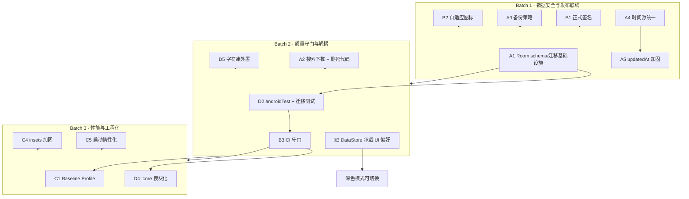

# 艾宾浩斯备忘录 · 架构技术债与优化路线图

> 评审基线：`./gradlew test` 84 passed / 0 failed；JaCoCo 行覆盖 15.95%（711/4457）、分支 4.82%；debug 16.71 MB / release 1.53 MB；零编译告警；无 androidTest；无 CI。
> 本文件仅分析与方案设计，**不修改任何已存在文件**。所有结论均附 `文件:行号` 证据。

---

## 0. 疑点核实速览（先核实，后结论）

| # | 原疑点 | 核实结果 | 关键证据 |
|---|--------|----------|----------|
| 1 | Room schema 导出/迁移基础设施缺失 | **属实**。`exportSchema=false`，`room.schemaLocation` 已配但 `app/schemas` 不存在，且 builder 无任何 fallback | `AppDatabase.kt:27`、`app/build.gradle.kts:67`、`AppDatabase.kt:42-52` |
| 2 | 时间源不统一 | **属实**。仓储直接 `LocalDate.now()`，两个 VM 用可注入 `todayProvider` | `MemoRepositoryImpl.kt:73` vs `ReviewViewModel.kt:71`、`DashboardViewModel.kt:49` |
| 3 | `updatedAt` 构造期默认值 / copy 隐患 | **部分属实**。默认值确实构造期求值；但当前**唯一生产 copy 点已显式覆盖** `updatedAt`，故非活跃 Bug，属"静默陷阱" | `ReviewTaskEntity.kt:45`、`ReviewRepositoryImpl.kt:41-47`（安全）、`PreviewFakes.kt:117-122`（debug-only，未覆盖） |
| 4 | 应用图标为占位符 | **属实**。无 `mipmap*`、无 `ic_launcher` | `AndroidManifest.xml:7,9`；`find` 无 mipmap 目录 |
| 5 | 备份策略未声明 | **属实**。`allowBackup=true`，无 `dataExtractionRules`/`fullBackupContent` | `AndroidManifest.xml:6` |
| 6 | release 用 debug 签名 | **属实** | `app/build.gradle.kts:35` |
| 7 | 无 baseline profile | **属实**。无 `androidx.profileinstaller`、无 `baseline-prof.txt` | `app/build.gradle.kts:70-105`；`find` 无命中 |
| 8 | service locator 可测试性边界 | **属实且更严重**：`EbbinghausApp.instance` 设值后**全项目无任何读取点（死代码）**；VM 装配散落在 `AppNavigation` 的 4 个匿名工厂 | `EbbinghausApp.kt:33,45`；grep `\.instance` 零命中；`AppNavigation.kt:77-118` |
| 9 | AppScaffold 自绘容器 insets | **目前不遮挡，但依赖"双计数巧合"**。各 Screen 内层 `Scaffold` 消费 `innerPadding`，`80dp(预留)+navBarInset` 恰等于 `80dp(栏)+gestureInset` | `AppScaffold.kt:78-113`；`MemoListScreen.kt:103,141`、`ReviewScreen.kt:100,138`、`SettingsScreen.kt:75,94`、`MemoDetailScreen.kt:97,155` |
| 10 | WebView/KaTeX 渲染路径 | **属实**。`assets/katex` 共 **484 KB**（`katex.min.js` 275 KB），`MathView` 无法 JVM 单测（`MathTextPreprocessor` 可测） | `MathView.kt:64-193`；`du -sh` = 484K |
| 11 | 其他技术债 | **发现 7 项新债**（见下表 D11–D17） | 见第 1 节 |

---

## 1. 技术债清单表

| 编号 | 问题 | 证据（文件:行号） | 影响面 | 严重度 | 修复成本 | 建议 |
|------|------|-------------------|--------|--------|----------|------|
| D01 | Room `exportSchema=false` + 无基线 schema + 无迁移基础设施 | `AppDatabase.kt:27`；`app/build.gradle.kts:67`；`AppDatabase.kt:42-52` | **未来任何 schema 变更 → 老用户升级即 `IllegalStateException` 启动崩溃**；无法写迁移测试 | **P1** | S–M | 见 A1 |
| D02 | 时间源不统一（仓储 `LocalDate.now()` vs VM `todayProvider`） | `MemoRepositoryImpl.kt:73`；`ReviewViewModel.kt:71`；`DashboardViewModel.kt:49` | 跨零点（23:59 录入 / 00:01 复习）可能把任务排到错误日；仓储层不可确定性测试 | **P1** | S | 见 A4 |
| D03 | `ReviewTaskEntity.updatedAt` 默认值构造期求值 | `ReviewTaskEntity.kt:45` | 当前安全（copy 显式覆盖），但任何新增 copy 会静默沿用旧值 | P2 | S | 见 A5 |
| D04 | 应用图标为系统占位符，无自适应图标 | `AndroidManifest.xml:7,9` | 桌面/商店显示为默认机器人图标；**上架必被拒** | P2（上架 P0） | M | 见 B2 |
| D05 | 备份策略未声明 | `AndroidManifest.xml:6` | 默认会把 `databases/ebbinghaus_memo.db` 整库上传 Google 云备份；Android 12+ 缺 `dataExtractionRules` 存在兼容/合规说明缺口 | **P1** | S | 见 A3 |
| D06 | release 复用 debug 签名 | `app/build.gradle.kts:35` | 无法上架；一旦用 debug key 发布将无法安全轮换 | **P0（发布前）** | S | 见 B1 |
| D07 | 无 Baseline Profile | 无 `profileinstaller` 依赖；无 `baseline-prof.txt` | Compose 冷启动未达最优（典型可再省 15%~30%） | P2 | M | 见 C1 |
| D08 | service locator 全局可变单例；`instance` 为死代码；VM 装配散落 | `EbbinghausApp.kt:33,45`（`instance` 零读取）；`AppNavigation.kt:77-118` | 单测必须手写 Fake；模块化/多进程受阻；隐藏的全局状态 | P2 | M | 见 D3 |
| D09 | 自绘导航容器不消费 insets，依赖双计数巧合 | `AppScaffold.kt:78-113`；`Dimens.kt:40`（`BottomBarHeight=80.dp` 硬编码） | 大字体/未来 M3 默认高度变化时底部栏可能遮挡内容 | P2 | S | 见 C4/A2 |
| D10 | WebView + KaTeX 渲染路径 | `MathView.kt:64-193`；`assets/katex` 484 KB | 内存占用、包体积、JVM 不可测、Chromium 初始化延迟（已用 120ms 延后缓解） | P2 | L | 见 C3 |
| D11 | 硬编码字符串（`strings.xml` 仅 `app_name`） | `strings.xml:1-3`；如 `AppNavigation.kt:332`、`MemoListViewModel.kt:133,277-279`、`DashboardBanner` 文案 | 无法本地化；文案改动需重编译；无障碍 `contentDescription` 亦为硬编码 | P2 | M | 见 B5/D5 |
| D12 | 搜索走"全表加载 + 内存过滤"，DAO SQL 搜索为死代码 | `MemoRepositoryImpl.kt:38-54`；`KnowledgeMemoDao.kt:35-40`（未被调用） | 数据量增长后每次搜索全表反序列化 + 主线程过滤 | P2 | M | 见 A2 |
| D13 | 未使用的 DAO/仓储方法（死代码） | `KnowledgeMemoDao.kt:40`；`ReviewTaskDao.kt:48,56` | 维护噪声、误导后来者 | P2 | S | 见 A2 |
| D14 | 无 CI | 无 `.github`、无任何流水线配置 | 84 个单测无自动守门，回归靠人工 | P2 | S–M | 见 B3 |
| D15 | 无 androidTest 仪器化测试 | 无 `app/src/androidTest`；JaCoCo 分母含整个 Compose 层 | Room DAO/迁移、Compose 交互零覆盖；D01 无法验证 | **P1** | L | 见 D2 |
| D16 | Manifest 主题硬编码 Light | `AndroidManifest.xml:11,17`（`Theme.Material.Light.NoActionBar`） | 深色模式下冷启动白闪；与 `Theme.kt:59` 系统深色判定不一致 | P2 | S | 见 B6 |
| D17 | `@Suppress("UNCHECKED_CAST")` 掩盖 | `AppNavigation.kt:79,88,101,113,270`；`MemoDetailScreen.kt:522` | 风险低（工厂泛型样板），但掩盖了可收敛为单一 `viewModelFactory` 的机会 | P2 | S | 见 D3 |

> 无 `TODO`/`FIXME`/`XXX`/`HACK` 命中；`@SuppressLint("SetJavaScriptEnabled")`（`MathView.kt:64`）为 WebView 离线资源所必需，属合理抑制。
> `LazyColumn` 主列表**已带 `key = { it.id }`**（`MemoListScreen.kt:293,319`），无缺 key 问题；`LoadingSkeleton.kt:135` 的 `items(count)` 为静态占位，无需 key。
> **无 N+1**：列表页仅查询 `knowledge_memos` 单表（`KnowledgeMemoDao.kt:32-33`），未逐行回查任务表；复习页用 `INNER JOIN` 一次取回（`ReviewTaskDao.kt:32-48`）。
> **ViewModel 未泄漏 Context**：所有 VM 构造仅接收 Repository 接口，Context 只在 `AppDatabase.getInstance` 与 Compose 层使用。

---

## 2. 优化方案（技术维度）

### A. 数据层健壮性

**A1 · 补全 Room schema 与迁移基础设施（对应 D01，最高优先级）**
- 做法：
  1. `AppDatabase.kt:27` 改 `exportSchema = true`。
  2. 执行一次 `./gradlew :app:assembleDebug`，KSP 会依据已配置的 `room.schemaLocation`（`app/build.gradle.kts:67`）生成 `app/schemas/com.ebbinghaus.memo.data.local.AppDatabase/1.json`，**将该目录纳入版本库**（`.gitignore` 不得排除）。
  3. `app/build.gradle.kts` 增加 `testImplementation("androidx.room:room-testing:2.6.1")` 与 androidTest 依赖。
  4. 迁移兜底策略：**只加** `.fallbackToDestructiveMigrationOnDowngrade()`（降级场景），**绝不**使用全量 `fallbackToDestructiveMigration()`——后者会静默清空用户数据。
- 涉及文件：`AppDatabase.kt`、`app/build.gradle.kts`、新增 `app/schemas/**`、新增 `app/src/androidTest/.../MigrationTest.kt`。
- 预期收益：从"改 schema = 上线崩溃"变为"可写迁移 + 可测试迁移"；解锁深色模式之外的业务字段演进（如软删除）。
- 风险：`schemas/` 首次生成需真实编译一次；忘记提交会退回原状（用 CI 校验 `git status` 干净）。
- 验证：新增一个空 `Migration(1,2)` + bump version 的临时分支，跑 `MigrationTestHelper` 断言 1→2 不丢数据、不崩溃。

**A2 · 索引与查询下推（D12/D13/D09）**
- 做法：`MemoRepositoryImpl.searchMemos` 改为复用 `KnowledgeMemoDao.searchMemos(keyword)`（SQL `LIKE` 下推）做首层过滤，仅在**多关键词 AND** 语义下于内存做二次精确匹配；删除 `ReviewTaskDao.getDueMemosWithTasksSync`、`getAllMemosWithTasks` 两个死方法。
- 涉及文件：`MemoRepositoryImpl.kt:38-54`、`KnowledgeMemoDao.kt:35-40`、`ReviewTaskDao.kt:48,56`。
- 预期收益：搜索不再全表反序列化；包体略降。
- 风险：SQL `LIKE` 对 `tags` 无索引，标签筛选仍走内存——若标签量增长再考虑独立 `tags` 表/FTS。
- 验证：新增单测断言 SQL 路径与内存路径结果一致（含多关键词、大小写、中文）。

**A3 · 备份策略显式声明（D05）**
- 做法：二选一并**显式写死**——
  - 方案甲（推荐，契合"离线单机、无网络权限"定位）：`android:allowBackup="false"`，明确不参与云备份。
  - 方案乙（若要保留本地迁移）：新增 `res/xml/backup_rules.xml` + `res/xml/data_extraction_rules.xml`，`include` 仅 `database` 与 `sharedpref`，`exclude` 缓存；manifest 挂 `android:fullBackupContent` 与 `android:dataExtractionRules`。
- 涉及文件：`AndroidManifest.xml:6`、新增 `res/xml/*.xml`。
- 预期收益：消除"用户数据被上传云端"的隐式行为；Android 12+ 行为明确。
- 风险：`allowBackup=false` 后用户换机无法自动恢复（产品需确认）。
- 验证：`adb shell bmgr backupnow` 检查备份集内容；或对照 `data_extraction_rules` 的 XML schema。

**A4 · 时间源统一（D02）**
- 做法：在 `MemoRepositoryImpl` 注入 `private val todayProvider: () -> LocalDate = { LocalDate.now() }`，`createMemo` 用 `todayProvider()`（`MemoRepositoryImpl.kt:73`）；装配点（`EbbinghausApp.kt:39`）默认值不变，测试可注入固定日期。若需更严谨，统一引入 `java.time.Clock` 并在三处共享同一 `Clock`。
- 涉及文件：`MemoRepositoryImpl.kt`、`EbbinghausApp.kt`、`AppNavigation.kt`（透传）。
- 预期收益：`createMemo` 的 Day0/Day1 排期可确定性测试；跨零点行为一致。
- 风险：需同步更新 `FakeRepositories.kt` 与 `PreviewFakes.kt` 的构造签名。
- 验证：新增单测注入 `{ LocalDate.of(2025,1,1) }`，断言初始任务 `dueDate == 2025-01-02`。

**A5 · 消除 `updatedAt` 静默陷阱（D03）**
- 做法：`ReviewTaskEntity.updatedAt` 去掉构造期默认值，改为**必填参数**（编译期强制调用方显式提供）；或在类 KDoc 中写明"copy 不刷新时间戳"。前者更稳。
- 涉及文件：`ReviewTaskEntity.kt:45`、`ReviewRepositoryImpl.kt:41`（已显式覆盖，无需改）、`PreviewFakes.kt:117`（补上 `updatedAt`）。
- 预期收益：从"靠人记得覆盖"变为"编译器强制"。
- 风险：改动波及所有 `ReviewTaskEntity(...)` 构造点（`PreviewFakes.kt:206` 等），需逐一补齐。
- 验证：编译通过即证明无遗漏构造点。

### B. 构建与发布

**B1 · 正式 release 签名（D06）** — 生成 upload keystore；`signingConfigs.create("release")` 从 `gradle.properties`/环境变量读取，**不入库密钥**；CI 用 Secrets 注入。涉及 `app/build.gradle.kts:25-36`、`gradle.properties`。验证：`./gradlew :app:assembleRelease` 后 `apksigner verify --print-certs` 显示正式证书。风险：密钥丢失不可恢复，需安全归档。

**B2 · 自适应图标（D04）** — 新增 `res/mipmap-anydpi-v26/ic_launcher.xml` + `ic_launcher_round.xml`，配 `res/drawable/ic_launcher_foreground.xml`（矢量）+ `res/values/ic_launcher_background.xml`；manifest 改 `android:icon="@mipmap/ic_launcher"`、`roundIcon="@mipmap/ic_launcher_round"`。涉及 `AndroidManifest.xml:7,9` + 新增 4 个资源。验证：Launcher 上圆形/方形/长投影三种遮罩正常。风险：矢量前景需保证安全区（66/108）。

**B3 · CI（D14）** — GitHub Actions：`ubuntu-latest` + JDK 17 + `gradle/actions/setup-gradle` 缓存；流水线执行 `./gradlew testDebugUnitTest lint assembleRelease`；失败即红灯。涉及新增 `.github/workflows/ci.yml`。预期收益：84 个单测获得自动守门；阻止 D01 类回归。风险：首版需调 Gradle 缓存与内存参数。验证：PR 触发绿灯。

**B4 · 版本目录（补充建议）** — 引入 `gradle/libs.versions.toml`，把散落在 `app/build.gradle.kts` 与根 `build.gradle.kts` 的版本号集中；`versionCode/versionName` 由 CI 或 git tag 注入。收益：升级依赖单点改动。风险：迁移期需一次性对齐。

**B5 · ProGuard 加固（低优先）** — 现有 `proguard-rules.pro` 已是"最小化"策略（正确）。AGP 8.x 默认 R8 full mode 已开；如需再压体积可评估 `-repackageclasses ''`。不建议引入 `-keep class **` 类全量规则。涉及 `app/proguard-rules.pro`。

**B6 · 启动主题对齐深色（D16）** — 将 manifest 的 `@android:style/Theme.Material.Light.NoActionBar`（`AndroidManifest.xml:11,17`）替换为自定义 `Theme.Ebbinghaus`（`values`/`values-night` 双份，`windowBackground` 与 Compose 背景色一致）。收益：消除深色模式冷启动白闪。验证：深色系统下冷启动无白帧。

### C. 性能

**C1 · Baseline Profile（D07）**
- 接入步骤：
  1. `implementation("androidx.profileinstaller:profileinstaller:1.4.1")`（`app/build.gradle.kts`）。
  2. 新建 `:baselineprofile` 测试模块（或 androidTest source set），用 `androidx.baselineprofile` 插件 + `BaselineProfileRule` 录制关键路径（冷启动 → 列表 → 详情 → 复习）。
  3. 生成 `app/src/main/baseline-prof.txt`，提交版本库；AGP 8.7 会在 release 构建时自动打包并安装。
- 预期收益：Compose 应用冷启动典型 **-15%~-30%**，首帧 JIT 抖动显著下降（量级取决于设备与首屏复杂度）。
- 风险：需可运行的模拟器/真机录制；profile 与代码强相关，需随版本回归重录。
- 验证：`adb shell dumpsys package` 查看 profile 已安装；用 Macrobenchmark 的 `StartupTimingMetric` 对比接入前后。

**C2 · 搜索性能** — 见 A2（SQL 下推）；UI 层 300ms 防抖已就位（`MemoListScreen.kt:188-195`），无需改动。

**C3 · WebView 路径评估（D10）** — 现状已相当克制：纯文本走原生 `Text` 快路径（`MathView.kt:76-86`），仅富文本才延迟 120ms 建 WebView。
- 替代路径对比：
  - **保留 WebView**（成本 S，收益 0）：KaTeX/marked 排版质量最高，484 KB 可接受。
  - **原生 Compose 渲染**（成本 L）：用 Kotlin 版 CommonMark 渲染 Markdown + 公式降级为 Unicode（复用 `MathTextPreprocessor.formatToUnicode`），可省 ~480 KB 与 WebView 内存，但会**丢失 LaTeX 排版能力**（分数、根号、矩阵），属功能回退。
  - **结论**：除非"包体积/内存"成为硬指标，否则**维持现状**；把力气放在 C1 与 A1。
- 验证：若尝试替换，需用 `MathTextPreprocessorTest` 的符号集回归 + 视觉对比。

**C4 · 重组与 insets 加固（D09）** — `AppScaffold` 改为 `Scaffold` 语义或显式 `WindowInsets.safeDrawing` 消费，使底部预留不再依赖"80dp 硬编码 + 内层 Scaffold 双计数"；`BottomBarHeight` 保留但改为由 `NavigationBar` 实测高度驱动（`onSizeChanged`）。涉及 `AppScaffold.kt:78-113`、`Dimens.kt:40`。验证：系统字体调至最大 + 3 键导航/手势导航切换，底部内容不被遮挡。

**C5 · 启动惰性化** — `EbbinghausApp.onCreate`（`EbbinghausApp.kt:31-42`）当前同步建库 + 建仓储，可改为 `by lazy`，把 Room 首次打开推迟到首个查询，缩短 `Application.onCreate` 主线程耗时。验证：`adb shell am start -W` 冷启动 `TotalTime` 对比。

### D. 可测试性与可维护性

**D1 · 时间源统一** — 同 A4。

**D2 · androidTest 路线（D15）**
- 分层引入：`androidx.test.ext:junit`、`androidx.test:runner`、`espresso`（可选）、`androidx.compose.ui:ui-test-junit4`、`androidx.room:room-testing`。
- 优先级：① Room DAO 仪器化测试（含 CASCADE 级联删除，当前仅靠单测无法覆盖 SQLite 外键行为）；② MigrationTestHelper 迁移测试（依赖 A1）；③ 关键 Compose 交互（列表→详情、复习评级、删除确认）。
- 预期收益：覆盖 JaCoCo 分母中的 UI 层；D01 的迁移正确性获得真实验证。
- 风险：需 Android 设备/模拟器，CI 需 emulator action 或改用 Robolectric 降低门槛。

**D3 · DI 边界收敛（D08）**
- 做法：① 删除死代码 `EbbinghausApp.instance`（`EbbinghausApp.kt:33,45`）或改为真正被读取；② 把 `AppNavigation.kt:77-118` 的 4 个匿名工厂抽到单一 `AppViewModelFactory.kt`，用 `viewModelFactory { initializer { ... } }` 收敛 `@Suppress("UNCHECKED_CAST")`；③ 抽出 `AppContainer`（持有 db + 3 repo），为未来 Hilt/Koin 留接入点。
- 预期收益：单测可直接 `AppContainer(FakeRepo...)` 装配；模块化时依赖边界清晰。
- 风险：`AppNavigation` 双入口签名需同步调整，波及 debug 预览。

**D4 · `:core` 模块化** — `core/` 已是纯 Kotlin（无 Android 依赖，见 `EbbinghausScheduler.kt`、`MathTextPreprocessor.kt`）。抽为独立 Gradle module 可获得编译期边界 + 更快增量编译。风险：首次拆分需处理 `namespace` 与测试源集迁移。

**D5 · 字符串外置（D11）** — 全量迁移 UI 文案至 `strings.xml`，含无障碍 `contentDescription`。收益：可本地化、文案集中管理。风险：`MemoListViewModel.kt:133,277-279` 的 Snackbar 文案在 VM 内拼接，需改为资源 ID + 参数或返回结构化事件由 UI 层取资源。

---

## 3. 关键架构建议：如何绕开 Room 迁移的"卡点"

**问题根因**：`UserSettingsEntity`（`UserSettingsEntity.kt:16-22`）把两类语义混在一张 Room 表里——
- **纯 UI 偏好**（未来的深色模式、动态取色、字号、列表密度）；
- **业务状态**（`dailyReviewLimit`、`lastActiveDate`、`lastPromptedDate`）。
任何新增偏好都落在同一张表 → 都要 bump Room version → 都要写迁移 → 团队历史上因此**放弃深色模式等特性**。

**建议方案：按"数据性质"分层存储**
- 纯 UI 偏好 → `androidx.datastore:datastore-preferences`（KV，无 schema version，加字段零迁移）。
- 业务关系数据（`knowledge_memos`、`review_tasks`）→ 保留 Room。
- 业务 KV 状态（`lastActiveDate`/`lastPromptedDate`）→ 建议一并迁入 DataStore（本质是时间戳 KV，非关系数据）。

**落地步骤（不改动 Room schema，故不触发迁移）**
1. 新增依赖 `implementation("androidx.datastore:datastore-preferences:1.1.1")`。
2. 新增 `core/preference/UserPreferencesRepository.kt`：定义 `darkMode`、`dynamicColor`、`fontScale`、`listDensity` 等 `Flow<Preferences>`，以及对应 `suspend fun setXxx()`。
3. 首次读取时，以 Room 现有 `dailyReviewLimit`（`SettingsRepositoryImpl.kt:16-20`）作为默认值来源，**不写入** DataStore 即可。
4. `Theme.kt:59` 的 `darkTheme` 参数改由 `UserPreferencesRepository` 驱动（当前硬编码 `isSystemInDarkTheme()`）。
5. 后续新增任何 UI 偏好只改 DataStore，**永不触碰 Room version**。

**取舍**
| 维度 | DataStore 承载偏好 | Room 承载偏好 |
|------|-------------------|---------------|
| 加字段成本 | 零迁移 | 每次 v→v+1 迁移 |
| 写入 | 事务性、单文件全量重写（偏好量小无碍） | 行级 UPDATE |
| 依赖 | +1 依赖（~200 KB） | 无 |
| 心智 | 两个数据源 | 单一数据源 |
| 适合 | 开关/枚举/数值偏好 | 与业务需同事务的字段 |

**必须澄清的边界（避免误用）**：
- DataStore **只解决"纯 UI 偏好"的迁移卡点**。
- **软删除属于业务 schema 变更**（`knowledge_memos` 需加 `deletedAt` 列），**仍需 Room 迁移**。它的卡点应通过 **A1（建立迁移基础设施）** 解决，而非 DataStore。
- 两者是互补关系：A1 让"业务字段演进"变得可做；DataStore 让"UI 偏好演进"变得无需迁移。

---

## 4. 推荐执行顺序

### Batch 1 · 数据安全与发布底线（无新功能，风险最低）
- 内容：**A1**（schema/迁移基础设施 + MigrationTestHelper）、**D06/B1**（正式签名）、**D04/B2**（自适应图标）、**A3**（备份策略显式化）、**A4/D1**（时间源统一）、**A5**（updatedAt 加固）。
- 依赖：A1 无前置；A5 依赖 A4 的构造点清理一并完成。
- 验收标准：
  - `app/schemas/.../1.json` 已生成并入库，CI 校验工作区干净；
  - 临时 bump 到 v2 的空迁移分支可跑通 `MigrationTestHelper`，升级不崩溃；
  - `./gradlew test` 仍 **84 passed**（新增时间源/updatedAt 用例后数量只增不减）；
  - release 包 `apksigner` 显示正式证书；Launcher 图标非占位符。

### Batch 2 · 质量守门与架构解耦
- 内容：**B3**（CI）、**D2**（androidTest 基础设施 + DAO/迁移测试）、**§3 DataStore 方案**（含深色模式开关落地）、**A2/D12/D13**（搜索下推 + 删死代码）、**D11/D5**（字符串外置）。
- 依赖：D2 的迁移测试依赖 Batch 1 的 A1；DataStore 落地独立于 A1（不碰 Room schema）。
- 验收标准：
  - CI 对每个 PR 自动跑单测 + lint + assembleRelease 并绿灯；
  - androidTest 覆盖 CASCADE 级联删除与 1→2 迁移；
  - 深色模式可在设置页切换并持久化，**Room 版本仍为 1**；
  - 搜索走 SQL 下推，`KnowledgeMemoDao.searchMemos` 不再是死代码。

### Batch 3 · 性能与工程化打磨
- 内容：**C1**（Baseline Profile）、**C5**（启动惰性化）、**D4**（`:core` 模块化）、**C4/D9**（insets 加固）、**C3/D10**（WebView 评估，倾向维持）、**D15**（Compose 交互测试补齐）、**D3/D8**（DI 收敛）。
- 依赖：C1 依赖可运行的 benchmark 模块；D4 依赖 Batch 2 的 CI 守门（模块化回归风险高）。
- 验收标准：
  - Macrobenchmark 量化冷启动相对 Batch 2 的改善（目标 ≥15%）；
  - `:core` 独立成 module 且无 Android 依赖泄漏（`./gradlew :core:test` 可独立运行）；
  - 最大字体 + 双导航模式下底部无遮挡；
  - JaCoCo 行覆盖较 15.95% 有可量化提升。

---

## 5. 任务依赖图

